# Pais Effect Demonstrator

> **A hackspace-scale experimental apparatus to test claims of anomalous electromagnetic field generation from accelerated motion of electrically charged matter.**

[](https://opensource.org/licenses/MIT)
[]()
[]()

---

## ⚠️ Important Disclaimers

1. **This is a scientific experiment, not a claim that the effect exists.** The Pais patents make extraordinary claims that have not been validated by mainstream physics.

2. **This project involves high voltage (10-30kV).** Follow all safety protocols. Do not attempt without proper training and equipment.

3. **Negative results are valuable.** Establishing where an effect does NOT appear is legitimate scientific data.

---

## Overview

This project provides complete documentation for building a **vibrating charged plate apparatus** to experimentally test the "Pais Effect" - claims made in [US Patent 2019/0295733A1](https://patents.google.com/patent/US20190295733A1) that accelerated motion of electrically charged matter produces anomalously enhanced electromagnetic fields.

### The Core Claim Being Tested

From the patent (Equation 7):
> For rapid time rates of change of accelerated vibration/spin, given that the time differential of acceleration is non-zero, EM energy flux is greatly amplified.

If true, a vibrating charged plate should produce magnetic fields significantly exceeding classical electrodynamic predictions, particularly during acceleration transients.

### Experimental Logic

```mermaid
flowchart TD
    A[Vibrating Charged Plate] --> B[Measure B-field]
    B --> C{Compare to Classical Prediction}
    C -->|B_measured ≈ B_classical| D[Null Result]
    C -->|B_measured >> B_classical| E[Anomaly Detected]
    D --> F[Document Parameter Space]
    E --> G[Control Experiments]
    G -->|Artifact Found| H[Explain Mundane Cause]
    G -->|No Artifact| I[Independent Replication]
```



---

## Project Status

| Phase | Description | Duration | Status |
|-------|-------------|----------|--------|
| 1 | Sensor Array & Baseline | 2 weekends | 📝 Documented |
| 2 | Mechanical Assembly | 2 weekends | 📝 Documented |
| 3 | HV Charging Integration | 2 weekends | 📝 Documented |
| 4 | Experimental Protocols | 2 weekends | 📝 Documented |
| 5 | Data Analysis & Iteration | Ongoing | 📝 Documented |

**Estimated Total Build Cost:** £400-900  
**Estimated Build Time:** 8-10 weekends

---

## Quick Start

1. **📖 Read safety documentation first:** [docs/SAFETY.md](docs/SAFETY.md)
2. **🔬 Understand the theory:** [docs/01-theory-background.md](docs/01-theory-background.md)
3. **🛒 Review bill of materials:** [hardware/BOM.md](hardware/BOM.md)
4. **🔧 Follow build phases:** [docs/](docs/)

---

## Repository Structure

```
pais-effect-demonstrator/
├── README.md                      # This file
├── LICENSE                        # MIT License
├── CONTRIBUTING.md                # How to contribute
│
├── docs/                          # Documentation
│   ├── SAFETY.md                  # ⚠️ READ FIRST
│   ├── 00-project-overview.md     # Detailed project description
│   ├── 01-theory-background.md    # Physics background
│   ├── 02-phase1-sensors.md       # Sensor array build
│   ├── 03-phase2-mechanical.md    # Vibration assembly
│   ├── 04-phase3-charging.md      # HV charging system
│   ├── 05-phase4-protocols.md     # Experimental procedures
│   ├── 06-phase5-analysis.md      # Data analysis methods
│   └── TROUBLESHOOTING.md         # Common issues
│
├── diagrams/                      # Technical diagrams
│   ├── svg/                       # SVG format diagrams
│   └── *.md                       # Mermaid diagram sources
│
├── hardware/                      # Hardware documentation
│   ├── BOM.md                     # Complete bill of materials
│   ├── schematics/                # Circuit schematics
│   └── mechanical/                # Mechanical drawings
│
├── software/                      # Software components
│   ├── arduino/                   # Data acquisition firmware
│   │   └── magnetometer_daq/      # Main DAQ sketch
│   ├── python/                    # Analysis scripts
│   │   ├── analysis/              # Data analysis tools
│   │   └── realtime/              # Real-time monitoring
│   └── calibration/               # Calibration procedures
│
├── protocols/                     # Experimental protocols
│   ├── 01-sensor-calibration.md
│   ├── 02-baseline-measurement.md
│   ├── 03-charged-plate-tests.md
│   └── 04-control-experiments.md
│
└── references/                    # Reference materials
    └── patent-summary.md          # Patent analysis
```

---

## System Architecture


---

## Key Specifications

| Parameter | Target Value | Rationale |
|-----------|--------------|-----------|
| Plate size | 100 × 100 × 1 mm | Balance of charge capacity and resonance |
| Plate material | Copper (polished) | High conductivity, easy to machine |
| Vibration frequency | 100 Hz - 10 kHz | Spans acoustic to ultrasonic |
| Vibration amplitude | 10-100 μm | Achievable with piezo stacks |
| Surface voltage | 10-30 kV | Practical corona charging range |
| Surface charge density | ~10 μC/m² | Achievable in air |
| Magnetometer sensitivity | < 100 nT | Detects weak anomalies |
| Sample rate | ≥ 1 kHz | Captures transients |

---

## What Would Success Look Like?

### Classical Prediction

A vibrating charged plate produces a time-varying magnetic field according to the Biot-Savart law. For our parameters:

- **Expected classical B-field at 5cm:** ~1-10 nT (barely detectable)
- **Scaling:** Linear with charge, linear with velocity

### If Pais Effect Exists

According to patent Equation 7, with rapid acceleration transients:

- **Expected anomalous B-field:** Could be 10-1000× classical prediction
- **Scaling:** Should show cubic (ν³) frequency dependence
- **Signature:** Correlated with dω/dt (acceleration transients)

### Detection Threshold

| Scenario | Expected Signal | Detectability |
|----------|-----------------|---------------|
| Strong Pais effect | μT - mT | Trivial to detect |
| Weak Pais effect | 100 nT - 1 μT | Detectable with fluxgate |
| Marginal effect | 10-100 nT | Challenging, needs averaging |
| No effect | < 10 nT | Classical physics confirmed |

---

## Safety Summary

| Hazard | Risk Level | Mitigation |
|--------|------------|------------|
| High voltage (30kV) | **HIGH** | Current-limited supply, insulated probes, discharge procedures |
| Electrical shock | **HIGH** | One-hand rule, isolation, safety interlocks |
| UV/Ozone from corona | Medium | Ventilation, limited exposure time |
| Hearing damage | Medium | Ear protection above 1kHz |
| Mechanical failure | Low | Polycarbonate shielding |

**Full safety documentation:** [docs/SAFETY.md](docs/SAFETY.md)

---

## Contributing

We welcome contributions! See [CONTRIBUTING.md](CONTRIBUTING.md) for guidelines.

### Ways to Contribute

- 🔧 Build the apparatus and share results
- 📊 Improve data analysis methods
- 📝 Enhance documentation
- 🐛 Report issues or suggest improvements
- 🔬 Propose additional control experiments

---

## License

This project is licensed under the MIT License - see [LICENSE](LICENSE) for details.

---

## Acknowledgments

- Original patent analysis inspired by public discussions of the "Pais Patents"
- Hackspace community for experimental methodology feedback
- Open source sensor and DAQ communities

---

## Contact

- **Issues:** Use GitHub Issues for bugs and feature requests
- **Discussions:** Use GitHub Discussions for questions and ideas
- **Results:** Please share your experimental results, positive or negative!

---

*Remember: Extraordinary claims require extraordinary evidence. Approach this experiment with rigorous skepticism and meticulous documentation.*
