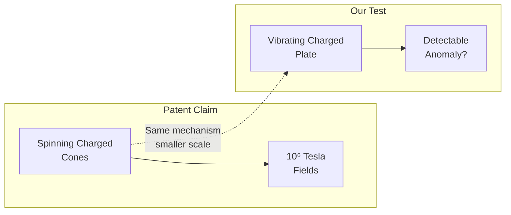
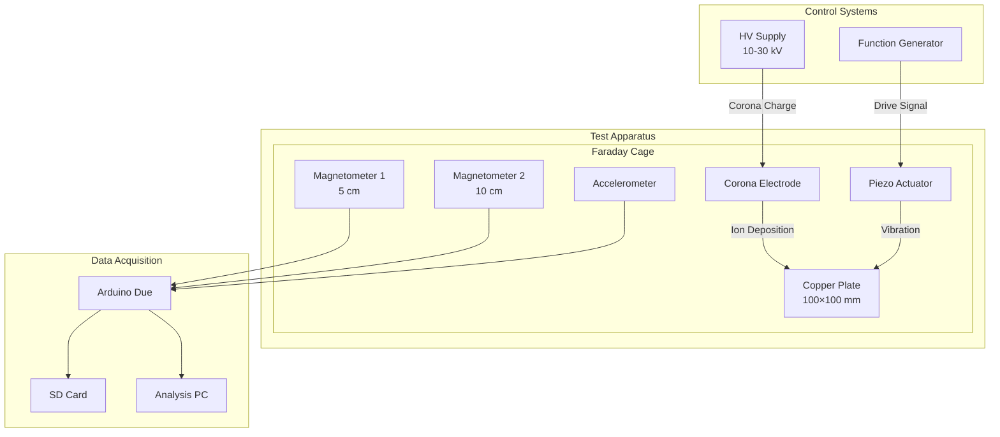
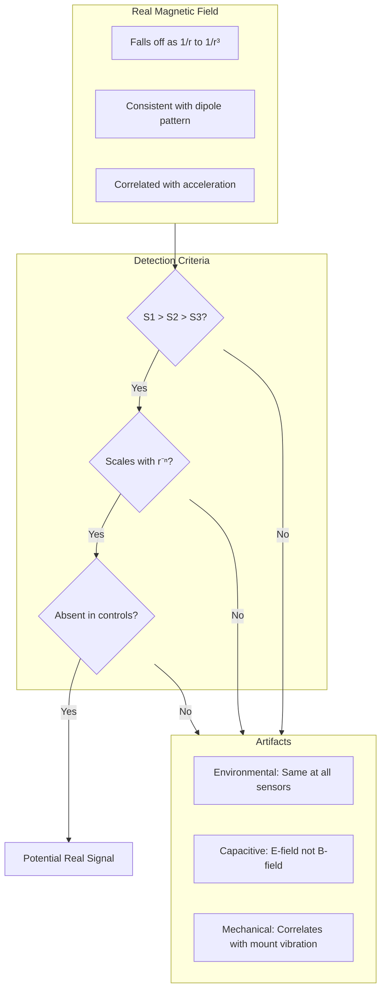
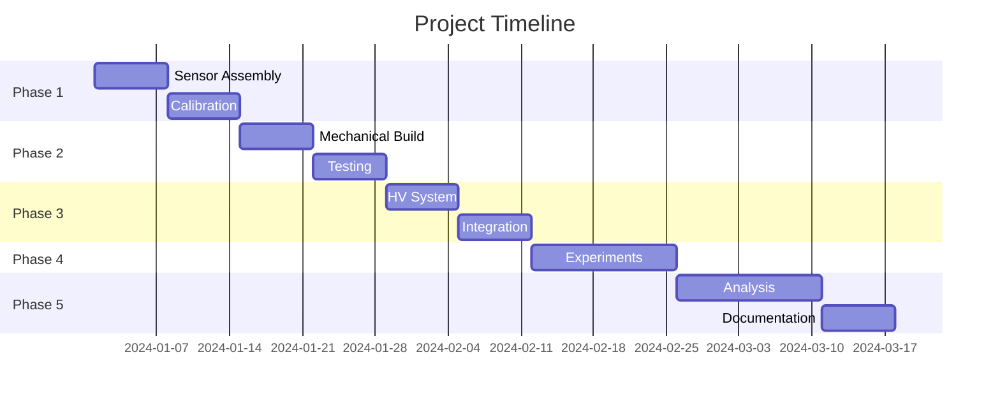

# Project Overview

> Detailed technical overview of the Pais Effect Demonstrator project

---

## What Are We Testing?

US Patent 2019/0295733A1 claims that rapidly accelerating electrically charged matter produces electromagnetic fields far exceeding classical predictions. This project builds a small-scale apparatus to test this claim.

### The Patent's Core Claims

1. **Enhanced EM Field Generation:** Accelerated charged matter produces EM flux scaling with ν³ (frequency cubed) rather than classical ν²

2. **Mechanism:** "Rapid yet smooth acceleration transients" of surface charge create the enhancement

3. **Magnitude:** Patent claims field strengths of 10⁶ Tesla are achievable (for comparison, the strongest continuous lab magnets produce ~45 T)

### Our Test Approach

Rather than attempt the patent's fusion device (requiring megawatts and extreme engineering), we test the underlying claimed mechanism at accessible scales:

**If the mechanism exists**, even our small-scale test should show measurable deviations from classical electromagnetism.

---

## System Architecture

---

## Key Parameters

### Mechanical System

| Parameter | Value | Notes |
|-----------|-------|-------|
| Plate dimensions | 100 × 100 × 1 mm | Copper (C101) |
| Plate mass | ~89 g | ρ = 8.96 g/cm³ |
| Vibration frequency | 100 Hz - 10 kHz | Limited by piezo/resonance |
| Vibration amplitude | 10-100 μm | Piezo stack dependent |
| Peak acceleration | ~400 g at 10 kHz, 10 μm | a = ω²x |
| Peak velocity | ~6 m/s at 10 kHz, 100 μm | v = ωx |

### Electrical System

| Parameter | Value | Notes |
|-----------|-------|-------|
| Charging voltage | 10-30 kV | Corona onset ~5-10 kV |
| Charging current | < 1 mA | Safety-limited |
| Surface charge density | 1-50 μC/m² | Humidity dependent |
| Total charge | 10-500 nC | On 0.01 m² plate |

### Expected Signals

| Source | Classical Prediction | If Pais Effect (100×) |
|--------|---------------------|----------------------|
| Magnetic field at 5 cm | ~0.1-1 pT | ~10-100 nT |
| Detection threshold | ~10 nT (fluxgate) | Easily detectable |

---

## Measurement Strategy

### Differential Measurement

Using multiple sensors at different distances allows us to distinguish real fields from artifacts:

### Control Experiments

Every potential artifact has a corresponding control:

| Artifact | Control Experiment |
|----------|-------------------|
| Mechanical vibration coupling | Run uncharged at same vibration |
| Capacitive coupling | Shield sensors, measure E-field separately |
| Inductive pickup from cables | Reroute cables, use twisted pairs |
| Ground loops | Vary grounding, use isolated supplies |
| Environmental noise | Compare to reference sensor outside cage |

---

## Success Criteria

### For Claiming Detection

All must be satisfied:
1. Signal > 3σ above noise floor
2. Signal reproducible (>5 consecutive trials)
3. Signal scales appropriately with charge/frequency
4. All control experiments negative
5. Signal persists with equipment variations
6. Independent operator can reproduce

### For Claiming Null Result

Document:
1. Complete test matrix executed
2. All controls passed
3. Noise floor characterised
4. Upper bound calculated
5. Parameter space clearly defined

**A well-documented null result is valuable science.**

---

## Why This Matters

### If Effect Detected (and verified)
- Would represent new physics beyond Maxwell's equations
- Requires extensive verification before any claims
- Would need independent replication at multiple facilities

### If Null Result
- Establishes experimental bounds on Pais claims
- Documents that effect does not appear in tested regime
- Contributes to scientific record on fringe claims
- Provides methodology for similar investigations

### Either Way
- Excellent learning experience in experimental physics
- Documents rigorous approach to extraordinary claims
- Creates open-source apparatus for others to replicate

---

## Project Philosophy

### Rigorous Skepticism

We approach this with the assumption that classical physics is correct. The burden of proof is entirely on detecting an anomaly, not on proving the null.

### Open Documentation

Everything is documented and open source:
- Build instructions
- Raw data
- Analysis code
- Results (positive or negative)

### Reproducibility

Anyone with access to a hackspace should be able to:
- Build the apparatus (~£500-1000)
- Run the experiments
- Verify (or refute) our results

### Intellectual Honesty

We will report what we find, whether it's:
- "Nothing detected" (most likely)
- "Something detected but explained by X"
- "Unexplained anomaly requiring further investigation"

We will never claim more than the evidence supports.

---

## Comparison to Patent Claims

| Patent Claim | Our Test | Gap |
|--------------|----------|-----|
| Spinning cones at ~10⁵ RPM | Vibrating plate at ~10⁴ Hz | Lower velocity |
| GW-TW power output | ~10 W drive power | ~10⁹× smaller |
| 10⁶ T fields | Detection threshold ~10 nT | ~10¹¹× smaller |
| Fusion conditions | Room temperature | Not testing fusion |

**Key insight:** If the underlying mechanism exists, it should produce *some* detectable enhancement even at our scale. The patent claims amplification factors of 10¹⁸ - even a tiny fraction of this would be detectable.

---

## Timeline

Estimated total: 10-12 weekends of work

---

## Getting Started

1. **Read [SAFETY.md](SAFETY.md)** - Non-negotiable
2. **Review [01-theory-background.md](01-theory-background.md)** - Understand what we're testing
3. **Check [../hardware/BOM.md](../hardware/BOM.md)** - Gather materials
4. **Follow the phases** - Each builds on the previous
5. **Document everything** - Your results matter

---

*Questions? Open an issue on GitHub or join the discussion.*
