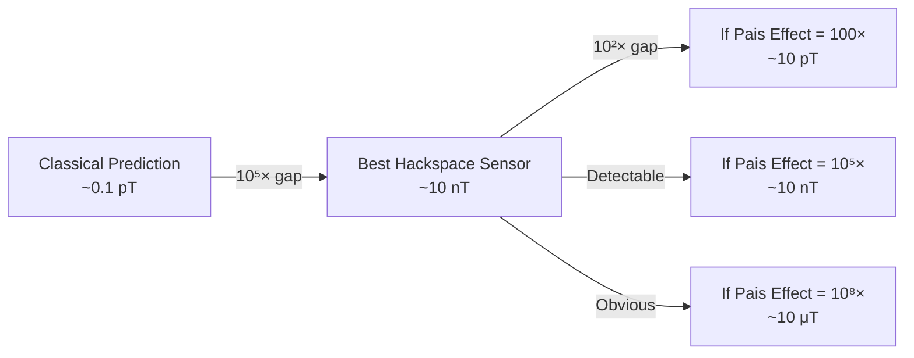
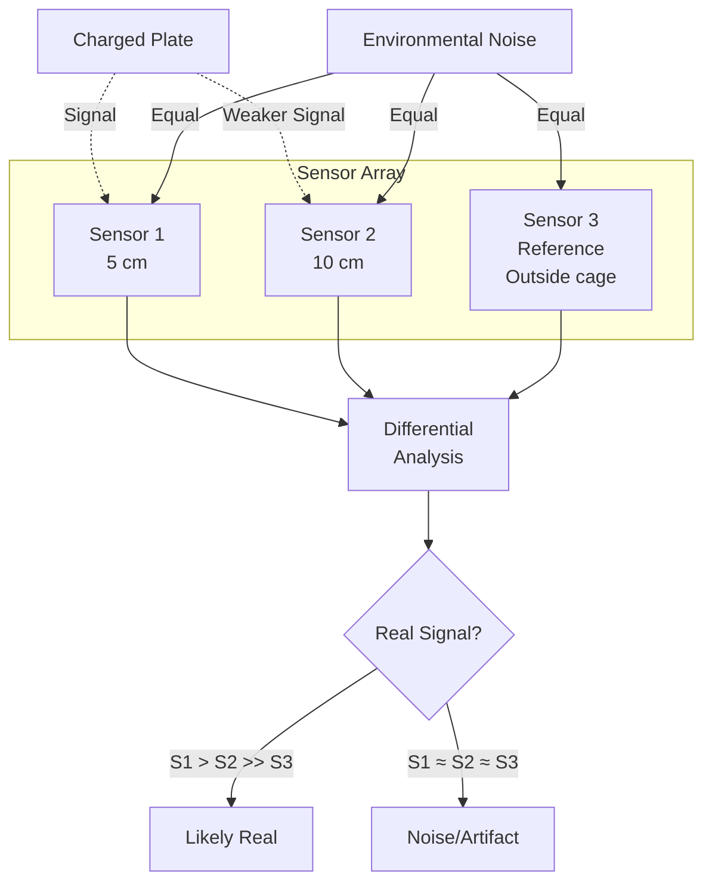

# Theory & Background

> Understanding what we're testing and why

---

## 1. The Patent Claims

US Patent 2019/0295733A1, "Plasma Compression Fusion Device," makes several extraordinary claims about electromagnetic field generation. While the patent is primarily about fusion, the underlying mechanism—enhanced EM fields from accelerated charged matter—is what we're testing.

### Key Equations from the Patent

**Equation 6** (Steady-state EM flux):
```
S_max = f_G × (σ²/ε₀) × (R_v × ν²) × t_op
```

Where:
- `S_max` = Maximum EM energy flux (W/m²)
- `f_G` = Geometric shape factor (1 for disc)
- `σ` = Surface charge density (C/m²)
- `ε₀` = Permittivity of free space (8.85 × 10⁻¹² F/m)
- `R_v` = Vibration amplitude (m)
- `ν` = Vibration frequency (Hz)
- `t_op` = Operational time at maximum acceleration (s)

**Equation 7** (With rapid acceleration transients):
```
S_max = f_G × (σ²/ε₀) × (R_v × ν³) × t_op
```

The key difference is **ν³ vs ν²**—the patent claims that rapid acceleration transients cause EM flux to scale with the *cube* of frequency rather than the square.

### What This Predicts

If the patent claims are valid:

| Frequency | Classical Scaling (ν²) | Patent Claim (ν³) | Enhancement |
|-----------|------------------------|-------------------|-------------|
| 100 Hz | 1× | 1× | 1× |
| 1 kHz | 100× | 1,000× | 10× |
| 10 kHz | 10,000× | 1,000,000× | 100× |

This is an enormous claimed enhancement at higher frequencies.

---

## 2. Classical Electrodynamics Prediction

### Oscillating Charged Plate

A uniformly charged plate oscillating sinusoidally produces:

1. **Electric field oscillation** (primary)
2. **Magnetic field** (secondary, from moving charge)

For a plate with:
- Surface charge density `σ`
- Area `A`
- Oscillation amplitude `x₀`
- Angular frequency `ω = 2πf`

The current is:
```
I(t) = σ × A × v(t) = σ × A × x₀ × ω × cos(ωt)
```

Peak current:
```
I_peak = σ × A × x₀ × ω
```

### Magnetic Field from Oscillating Current

Using the Biot-Savart approximation for a current sheet at distance `r`:

```
B ≈ μ₀ × I / (2π × r)
```

For our target parameters:
- `σ = 10 μC/m² = 10⁻⁵ C/m²`
- `A = 0.01 m²` (100×100 mm plate)
- `x₀ = 50 μm = 5×10⁻⁵ m`
- `f = 1 kHz`, so `ω = 6283 rad/s`
- `r = 0.05 m` (5 cm distance)

```
I_peak = 10⁻⁵ × 0.01 × 5×10⁻⁵ × 6283 = 3.14 × 10⁻⁸ A = 31.4 nA
```

```
B_classical ≈ (4π×10⁻⁷ × 3.14×10⁻⁸) / (2π × 0.05)
           ≈ 1.26 × 10⁻¹³ T
           ≈ 0.13 pT
```

This is **extremely small**—far below our sensor threshold.

### More Realistic Assessment

The above is a simplified model. A more complete treatment using:
- Retarded potentials
- Finite plate geometry
- Edge effects
- Higher-order multipole contributions

Still yields fields in the **pT to nT range** at 5 cm for achievable parameters.

---

## 3. Detection Requirements

### What We Can Detect

| Sensor Type | Typical Resolution | Our Target |
|-------------|-------------------|------------|
| Fluxgate magnetometer | 1-10 nT | ~10 nT |
| HMC5883L | ~100 nT | ~200 nT |
| SQUID | 1 fT | N/A (requires cryogenics) |

### Gap Analysis



**Interpretation:**
- If Pais Effect provides < 10⁵× enhancement → **Null result** (below detection)
- If Pais Effect provides 10⁵× - 10⁷× enhancement → **Marginal detection** (needs averaging)
- If Pais Effect provides > 10⁷× enhancement → **Clear detection**

The patent claims suggest enhancements that should be easily detectable if the effect exists at claimed magnitudes.

---

## 4. Experimental Strategy

Given the detection gap, our strategy is:

### 4.1 Maximize Signal Generation

Push all source parameters to practical limits:

| Parameter | Target | How |
|-----------|--------|-----|
| Charge density (σ) | Maximum sustainable | Corona charging, humidity control |
| Frequency (ν) | 100 Hz - 10 kHz | Function generator + piezo |
| Amplitude (x₀) | 50-100 μm | High-displacement piezo stack |
| Plate area (A) | 0.01 m² | 100×100 mm copper |

### 4.2 Minimize Sensor Distance

```
B ∝ 1/r (near field) to 1/r³ (far field)
```

Place primary sensor at minimum safe distance (~5 cm).

### 4.3 Use Acceleration Transients

The patent specifically emphasizes:
> "smooth yet rapid acceleration transients"

Test profiles:
- Sinusoidal (baseline)
- Frequency chirps (rapid ν change)
- Amplitude ramps (rapid acceleration)
- Square wave bursts (sharp transients)

### 4.4 Differential Measurement

Use sensor array to distinguish:
- True EM field (falls off with distance predictably)
- Environmental noise (affects all sensors similarly)
- Artifacts (inconsistent patterns)



---

## 5. Potential Artifacts & Controls

### 5.1 Mechanical Artifacts

**Problem:** Vibrating sensors in Earth's magnetic field (~50 μT) create apparent signals.

**Signature:** Signal proportional to vibration amplitude, not charge.

**Control:** Run identical mechanical motion with uncharged plate.

### 5.2 Capacitive Coupling

**Problem:** Oscillating electric field couples capacitively to sensor electronics.

**Signature:** Signal phase-locked to drive, present even without magnetometer element.

**Control:** Shield magnetometer; compare to accelerometer timing; test with dummy sensor.

### 5.3 Inductive Pickup

**Problem:** Drive amplifier, piezo cables create stray magnetic fields.

**Signature:** Field pattern doesn't match expected dipole; affected by cable routing.

**Control:** Careful cable routing; twisted pairs; measure with all cables but plate disconnected.

### 5.4 Ground Loops

**Problem:** Multiple ground paths create circulating currents.

**Signature:** 50/60 Hz components; changes with equipment arrangement.

**Control:** Star grounding; isolated USB; battery-powered sensors if needed.

### 5.5 Piezoelectric Sensor Interference

**Problem:** MEMS magnetometers may be affected by vibration directly.

**Signature:** Response to mechanical vibration even when magnetically shielded.

**Control:** Vibration-isolate sensor; compare isolated vs. non-isolated response.

---

## 6. Expected Results & Interpretation

### Scenario A: No Anomalous Signal

**Observation:** Measured field consistent with classical prediction (or below detection limit).

**Interpretation:** 
- Pais Effect does not exist at testable magnitudes, OR
- Effect requires parameters beyond our apparatus (higher charge, frequency, etc.)

**Value:** Establishes experimental bounds; documents parameter space where effect is absent.

### Scenario B: Anomalous Signal Detected

**Observation:** Measured field significantly exceeds classical prediction.

**Required Verification:**
1. Reproducibility (multiple trials)
2. Parameter scaling (does it match ν³ prediction?)
3. Artifact elimination (all controls negative)
4. Independent replication (different apparatus)

**If verified:** Would be extraordinary result requiring peer review and theoretical explanation.

### Scenario C: Ambiguous Results

**Observation:** Some trials show excess, others don't; inconsistent scaling.

**Interpretation:** Likely uncontrolled variable or subtle artifact.

**Action:** Improve controls; increase trials; seek additional expertise.

---

## 7. Scientific Context

### Why Mainstream Physics is Skeptical

The Pais patents claim effects that would require:
- New physics beyond Maxwell's equations
- Violation of energy conservation expectations
- Mechanisms not observed in decades of accelerator physics

These are extraordinary claims. The burden of proof is high.

### Why We Test Anyway

1. **Experimental falsification is valuable** - Negative results have scientific worth
2. **Hackspace science is low-cost** - We can test claims others might not bother with
3. **Learning experience** - Building the apparatus teaches real experimental physics
4. **Small probability of discovery** - History has surprises; testing is how we find them

### Related Experimental Traditions

This experiment shares methodology with:
- Electrogravitic experiments (Biefeld-Brown, etc.)
- Podkletnov gravity modification claims
- Various "free energy" claim tests

Most such tests yield null results. That's valuable too.

---

## 8. Further Reading

### Primary Source
- US Patent 2019/0295733A1: "Plasma Compression Fusion Device"
- Related Pais patents on USPTO/Google Patents

### Classical EM Theory
- Griffiths, "Introduction to Electrodynamics" - Standard textbook
- Jackson, "Classical Electrodynamics" - Advanced reference

### Experimental Methods
- Bevington & Robinson, "Data Reduction and Error Analysis" - Statistical methods
- Hughes & Hase, "Measurements and their Uncertainties" - Error analysis

### Magnetic Sensing
- Tumanski, "Handbook of Magnetic Measurements" - Sensor physics
- Ripka, "Magnetic Sensors and Magnetometers" - Practical guide

---

*Next: [Phase 1 - Sensor Array Assembly](02-phase1-sensors.md)*
