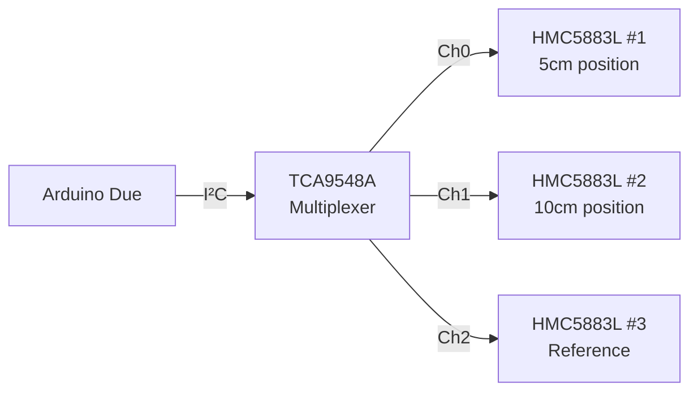
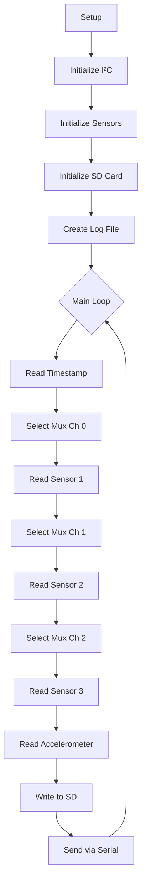

# Phase 1: Sensor Array & Baseline

> **Duration:** 2 weekends  
> **Cost:** £100-200  
> **Prerequisites:** Basic soldering, Arduino familiarity

---

## Objectives

1. Assemble and calibrate magnetometer array
2. Build data acquisition system
3. Establish environmental noise baseline
4. Characterize sensor performance

---

## Bill of Materials (Phase 1)

| Item | Qty | Est. Cost | Status |
|------|-----|-----------|--------|
| Fluxgate Magnetometer (or HMC5883L as primary) | 1 | £100-250 | ☐ |
| HMC5883L Breakout Boards | 3 | £15 | ☐ |
| ADXL345 Accelerometer | 1 | £8 | ☐ |
| Arduino Due | 1 | £35 | ☐ |
| SD Card Module | 1 | £4 | ☐ |
| SD Card 32GB | 1 | £8 | ☐ |
| Logic Level Shifters | 2 | £6 | ☐ |
| Prototype PCB | 2 | £4 | ☐ |
| Header Pins | 1 pack | £3 | ☐ |
| Hookup Wire | 1 pack | £8 | ☐ |
| **Total** | | **~£190-290** | |

---

## Part 1: Magnetometer Array Assembly

### 1.1 Understanding the HMC5883L

The HMC5883L (and pin-compatible QMC5883L) is a 3-axis magnetometer:
- Range: ±800 μT (±8 Gauss)
- Resolution: ~200 nT (0.2 μT) 
- Interface: I²C
- Address: 0x1E (HMC) or 0x0D (QMC)
- Sample rate: Up to 75 Hz (HMC) or 200 Hz (QMC)

**Limitations:**
- Resolution insufficient for detecting classical fields
- Useful for detecting strong anomalies and environmental noise

### 1.2 I²C Address Conflict Resolution

Multiple HMC5883L sensors have the same I²C address. Solutions:

**Option A: I²C Multiplexer (TCA9548A)**



**Option B: Software I²C on Different Pins**
- Use hardware I²C for primary sensor
- Use software I²C (bit-banged) on GPIO for others
- Slower but no additional hardware

**Option C: Mixed Sensor Types**
- HMC5883L (0x1E) for position 1
- QMC5883L (0x0D) for position 2
- Different sensor (MLX90393, 0x0C) for position 3

**Recommended:** Option A (multiplexer) for cleanest implementation.

### 1.3 Wiring Diagram

```
Arduino Due
    │
    ├── 3.3V ──────────┬─────────────┬─────────────┬─────────────┐
    │                  │             │             │             │
    ├── GND ───────────┼─────────────┼─────────────┼─────────────┤
    │                  │             │             │             │
    ├── SDA (20) ──────┼── SDA       │             │             │
    │                  │             │             │             │
    ├── SCL (21) ──────┼── SCL       │             │             │
    │                  │             │             │             │
    │               TCA9548A      HMC5883L     HMC5883L     HMC5883L
    │               Multiplexer   Sensor 1     Sensor 2     Sensor 3
    │                  │             │             │             │
    │                  ├── SD0 ──────┴── SDA       │             │
    │                  ├── SC0 ───────── SCL       │             │
    │                  │                           │             │
    │                  ├── SD1 ────────────────────┴── SDA       │
    │                  ├── SC1 ─────────────────────── SCL       │
    │                  │                                         │
    │                  ├── SD2 ──────────────────────────────────┴── SDA
    │                  └── SC2 ───────────────────────────────────── SCL
    │
    ├── Pin 4 ─────────── CS (SD Card Module)
    ├── Pin 11 ────────── MOSI (SD Card Module)  
    ├── Pin 12 ────────── MISO (SD Card Module)
    └── Pin 13 ────────── SCK (SD Card Module)

Note: Use 4.7kΩ pull-ups on main I²C bus (SDA, SCL)
      TCA9548A handles pull-ups on downstream channels
```

### 1.4 Assembly Steps

**Step 1: Prepare Sensor Boards**
1. Solder header pins to each HMC5883L breakout
2. Test each board individually before integration
3. Label boards clearly (Sensor 1, 2, 3)

**Step 2: Prepare Multiplexer**
1. Solder headers to TCA9548A breakout
2. Connect address pins (A0, A1, A2) to GND for address 0x70

**Step 3: Build Main PCB**
1. Mount Arduino Due headers on prototype PCB
2. Add TCA9548A socket
3. Add I²C pull-up resistors (4.7kΩ to 3.3V)
4. Add power distribution rails
5. Add sensor connectors (JST or pin headers)

**Step 4: Build Sensor Cables**
1. Use shielded 4-conductor cable for each sensor
2. Length: 20cm, 30cm, 50cm (for different positions)
3. Shield connected to GND at Arduino end only (avoid ground loops)
4. Add ferrite beads at both ends

**Step 5: Final Assembly**
1. Connect multiplexer to Arduino
2. Connect sensors to multiplexer channels
3. Double-check all connections before power-on

---

## Part 2: Data Acquisition Firmware

### 2.1 Core Firmware Architecture



### 2.2 Arduino Sketch

Create file: `/software/arduino/magnetometer_daq/magnetometer_daq.ino`

```cpp
/*
 * Pais Effect Demonstrator - Data Acquisition
 * 
 * Reads 3× HMC5883L magnetometers via TCA9548A multiplexer
 * Logs to SD card and streams via Serial
 * 
 * Hardware:
 *   - Arduino Due (84 MHz, 12-bit ADC)
 *   - TCA9548A I²C Multiplexer
 *   - 3× HMC5883L Magnetometers
 *   - ADXL345 Accelerometer
 *   - SD Card Module
 */

#include <Wire.h>
#include <SD.h>
#include <SPI.h>

// ===== CONFIGURATION =====
#define SAMPLE_RATE_HZ    100     // Target sample rate
#define SD_CS_PIN         4       // SD card chip select
#define MUX_ADDRESS       0x70    // TCA9548A I²C address
#define HMC_ADDRESS       0x1E    // HMC5883L I²C address
#define ADXL_ADDRESS      0x53    // ADXL345 I²C address
#define SERIAL_BAUD       115200
#define BUFFER_SIZE       512     // SD write buffer

// ===== GLOBAL VARIABLES =====
File logFile;
char filename[13];
uint32_t sampleCount = 0;
uint32_t lastSampleMicros = 0;
uint32_t sampleIntervalMicros;

// Sensor data structure
struct SensorData {
    uint32_t timestamp_us;
    int16_t mag1_x, mag1_y, mag1_z;
    int16_t mag2_x, mag2_y, mag2_z;
    int16_t mag3_x, mag3_y, mag3_z;
    int16_t acc_x, acc_y, acc_z;
};

SensorData currentData;
char sdBuffer[BUFFER_SIZE];
int bufferPos = 0;

// ===== FUNCTION PROTOTYPES =====
void selectMuxChannel(uint8_t channel);
bool initHMC5883L();
bool initADXL345();
void readHMC5883L(int16_t* x, int16_t* y, int16_t* z);
void readADXL345(int16_t* x, int16_t* y, int16_t* z);
void createNewLogFile();
void writeDataToSD();
void sendDataSerial();

// ===== SETUP =====
void setup() {
    // Initialize serial
    Serial.begin(SERIAL_BAUD);
    while (!Serial && millis() < 3000); // Wait up to 3s for Serial
    
    Serial.println(F("=== Pais Effect Demonstrator DAQ ==="));
    Serial.println(F("Initializing..."));
    
    // Initialize I²C
    Wire.begin();
    Wire.setClock(400000); // 400 kHz I²C
    
    // Calculate sample interval
    sampleIntervalMicros = 1000000 / SAMPLE_RATE_HZ;
    
    // Initialize sensors
    Serial.print(F("Initializing magnetometers... "));
    bool sensorsOK = true;
    
    for (uint8_t ch = 0; ch < 3; ch++) {
        selectMuxChannel(ch);
        delay(10);
        if (!initHMC5883L()) {
            Serial.print(F("FAIL on channel "));
            Serial.println(ch);
            sensorsOK = false;
        }
    }
    
    if (sensorsOK) {
        Serial.println(F("OK"));
    }
    
    // Initialize accelerometer (on main bus or channel 3)
    Serial.print(F("Initializing accelerometer... "));
    selectMuxChannel(7); // Use unused channel to access main bus
    if (initADXL345()) {
        Serial.println(F("OK"));
    } else {
        Serial.println(F("FAIL"));
    }
    
    // Initialize SD card
    Serial.print(F("Initializing SD card... "));
    if (SD.begin(SD_CS_PIN)) {
        Serial.println(F("OK"));
        createNewLogFile();
    } else {
        Serial.println(F("FAIL - continuing without logging"));
    }
    
    Serial.println(F("Initialization complete."));
    Serial.print(F("Sample rate: "));
    Serial.print(SAMPLE_RATE_HZ);
    Serial.println(F(" Hz"));
    Serial.println(F(""));
    Serial.println(F("timestamp_us,m1x,m1y,m1z,m2x,m2y,m2z,m3x,m3y,m3z,ax,ay,az"));
    
    lastSampleMicros = micros();
}

// ===== MAIN LOOP =====
void loop() {
    uint32_t now = micros();
    
    // Check if it's time for next sample
    if (now - lastSampleMicros >= sampleIntervalMicros) {
        lastSampleMicros = now;
        
        // Record timestamp
        currentData.timestamp_us = now;
        
        // Read magnetometer 1
        selectMuxChannel(0);
        readHMC5883L(&currentData.mag1_x, &currentData.mag1_y, &currentData.mag1_z);
        
        // Read magnetometer 2
        selectMuxChannel(1);
        readHMC5883L(&currentData.mag2_x, &currentData.mag2_y, &currentData.mag2_z);
        
        // Read magnetometer 3
        selectMuxChannel(2);
        readHMC5883L(&currentData.mag3_x, &currentData.mag3_y, &currentData.mag3_z);
        
        // Read accelerometer
        readADXL345(&currentData.acc_x, &currentData.acc_y, &currentData.acc_z);
        
        // Output data
        sendDataSerial();
        writeDataToSD();
        
        sampleCount++;
    }
}

// ===== I²C MULTIPLEXER =====
void selectMuxChannel(uint8_t channel) {
    if (channel > 7) return;
    Wire.beginTransmission(MUX_ADDRESS);
    Wire.write(1 << channel);
    Wire.endTransmission();
}

// ===== HMC5883L FUNCTIONS =====
bool initHMC5883L() {
    // Check WHO_AM_I
    Wire.beginTransmission(HMC_ADDRESS);
    Wire.write(0x0A); // ID register A
    Wire.endTransmission();
    Wire.requestFrom(HMC_ADDRESS, 3);
    
    if (Wire.available() < 3) return false;
    
    char id[3];
    id[0] = Wire.read();
    id[1] = Wire.read();
    id[2] = Wire.read();
    
    if (id[0] != 'H' || id[1] != '4' || id[2] != '3') {
        return false;
    }
    
    // Configure: 8 samples averaged, 75 Hz, normal measurement
    Wire.beginTransmission(HMC_ADDRESS);
    Wire.write(0x00); // Config Register A
    Wire.write(0x78); // 8 samples, 75 Hz, normal
    Wire.endTransmission();
    
    // Set gain to ±1.3 Gauss (1090 LSB/Gauss)
    Wire.beginTransmission(HMC_ADDRESS);
    Wire.write(0x01); // Config Register B
    Wire.write(0x20); // Gain = 1
    Wire.endTransmission();
    
    // Continuous measurement mode
    Wire.beginTransmission(HMC_ADDRESS);
    Wire.write(0x02); // Mode Register
    Wire.write(0x00); // Continuous
    Wire.endTransmission();
    
    delay(10);
    return true;
}

void readHMC5883L(int16_t* x, int16_t* y, int16_t* z) {
    Wire.beginTransmission(HMC_ADDRESS);
    Wire.write(0x03); // Start at data register
    Wire.endTransmission();
    
    Wire.requestFrom(HMC_ADDRESS, 6);
    
    if (Wire.available() >= 6) {
        // Data order: X_MSB, X_LSB, Z_MSB, Z_LSB, Y_MSB, Y_LSB
        *x = (Wire.read() << 8) | Wire.read();
        *z = (Wire.read() << 8) | Wire.read();
        *y = (Wire.read() << 8) | Wire.read();
    } else {
        *x = *y = *z = 0;
    }
}

// ===== ADXL345 FUNCTIONS =====
bool initADXL345() {
    // Check device ID
    Wire.beginTransmission(ADXL_ADDRESS);
    Wire.write(0x00); // DEVID register
    Wire.endTransmission();
    Wire.requestFrom(ADXL_ADDRESS, 1);
    
    if (Wire.available() < 1) return false;
    if (Wire.read() != 0xE5) return false;
    
    // Set data format: full resolution, ±16g
    Wire.beginTransmission(ADXL_ADDRESS);
    Wire.write(0x31); // DATA_FORMAT
    Wire.write(0x0B); // Full resolution, ±16g
    Wire.endTransmission();
    
    // Set data rate: 100 Hz
    Wire.beginTransmission(ADXL_ADDRESS);
    Wire.write(0x2C); // BW_RATE
    Wire.write(0x0A); // 100 Hz
    Wire.endTransmission();
    
    // Enable measurement
    Wire.beginTransmission(ADXL_ADDRESS);
    Wire.write(0x2D); // POWER_CTL
    Wire.write(0x08); // Measure bit
    Wire.endTransmission();
    
    delay(10);
    return true;
}

void readADXL345(int16_t* x, int16_t* y, int16_t* z) {
    Wire.beginTransmission(ADXL_ADDRESS);
    Wire.write(0x32); // Start at DATAX0
    Wire.endTransmission();
    
    Wire.requestFrom(ADXL_ADDRESS, 6);
    
    if (Wire.available() >= 6) {
        *x = Wire.read() | (Wire.read() << 8);
        *y = Wire.read() | (Wire.read() << 8);
        *z = Wire.read() | (Wire.read() << 8);
    } else {
        *x = *y = *z = 0;
    }
}

// ===== SD CARD FUNCTIONS =====
void createNewLogFile() {
    // Find next available filename
    for (int i = 0; i < 1000; i++) {
        sprintf(filename, "LOG%03d.CSV", i);
        if (!SD.exists(filename)) {
            break;
        }
    }
    
    logFile = SD.open(filename, FILE_WRITE);
    if (logFile) {
        // Write header
        logFile.println(F("timestamp_us,m1x,m1y,m1z,m2x,m2y,m2z,m3x,m3y,m3z,ax,ay,az"));
        logFile.flush();
        Serial.print(F("Logging to: "));
        Serial.println(filename);
    }
}

void writeDataToSD() {
    if (!logFile) return;
    
    // Format data line
    int len = snprintf(sdBuffer + bufferPos, BUFFER_SIZE - bufferPos,
        "%lu,%d,%d,%d,%d,%d,%d,%d,%d,%d,%d,%d,%d\n",
        currentData.timestamp_us,
        currentData.mag1_x, currentData.mag1_y, currentData.mag1_z,
        currentData.mag2_x, currentData.mag2_y, currentData.mag2_z,
        currentData.mag3_x, currentData.mag3_y, currentData.mag3_z,
        currentData.acc_x, currentData.acc_y, currentData.acc_z);
    
    bufferPos += len;
    
    // Write buffer when nearly full
    if (bufferPos > BUFFER_SIZE - 100) {
        logFile.write(sdBuffer, bufferPos);
        logFile.flush();
        bufferPos = 0;
    }
}

// ===== SERIAL OUTPUT =====
void sendDataSerial() {
    Serial.print(currentData.timestamp_us);
    Serial.print(',');
    Serial.print(currentData.mag1_x); Serial.print(',');
    Serial.print(currentData.mag1_y); Serial.print(',');
    Serial.print(currentData.mag1_z); Serial.print(',');
    Serial.print(currentData.mag2_x); Serial.print(',');
    Serial.print(currentData.mag2_y); Serial.print(',');
    Serial.print(currentData.mag2_z); Serial.print(',');
    Serial.print(currentData.mag3_x); Serial.print(',');
    Serial.print(currentData.mag3_y); Serial.print(',');
    Serial.print(currentData.mag3_z); Serial.print(',');
    Serial.print(currentData.acc_x); Serial.print(',');
    Serial.print(currentData.acc_y); Serial.print(',');
    Serial.println(currentData.acc_z);
}
```

---

## Part 3: Sensor Calibration

### 3.1 Magnetometer Calibration

Each magnetometer needs calibration for:
- **Hard iron offset:** Permanent magnetic fields from nearby ferrous materials
- **Soft iron distortion:** Distortion of field by nearby conductive materials
- **Scale factors:** Variations between sensor axes

**Calibration Procedure:**

1. Mount sensor in final position (or representative position)
2. Rotate sensor through all orientations (tumble calibration)
3. Record min/max values for each axis
4. Calculate offsets and scale factors

```python
# Calibration calculation
offset_x = (max_x + min_x) / 2
offset_y = (max_y + min_y) / 2
offset_z = (max_z + min_z) / 2

scale_x = (max_x - min_x) / 2
scale_y = (max_y - min_y) / 2
scale_z = (max_z - min_z) / 2

avg_scale = (scale_x + scale_y + scale_z) / 3

# Apply calibration to readings
calibrated_x = (raw_x - offset_x) * (avg_scale / scale_x)
calibrated_y = (raw_y - offset_y) * (avg_scale / scale_y)
calibrated_z = (raw_z - offset_z) * (avg_scale / scale_z)
```

### 3.2 Accelerometer Calibration

The ADXL345 needs offset calibration:

1. Place sensor on level surface
2. Record Z-axis reading (should be ~256 for 1g at ±16g range)
3. Flip sensor, record -Z reading
4. Repeat for X and Y axes
5. Calculate offsets

### 3.3 Cross-Calibration

Verify all three magnetometers read the same field:

1. Place all sensors equidistant from a test magnet
2. Record readings simultaneously
3. Calculate correction factors to normalize responses

---

## Part 4: Baseline Measurement

### 4.1 Environmental Noise Characterization

Before the experiment, characterize your environment:

**Step 1: 24-hour baseline recording**
- Log continuously for 24+ hours
- Capture daily variations (HVAC, foot traffic, etc.)

**Step 2: Frequency analysis**
- FFT the time series
- Identify dominant noise frequencies
- Common sources:
  - 50/60 Hz: Mains
  - Harmonics: 100, 150, 200 Hz...
  - HVAC: ~1-10 Hz modulation
  - Vehicles: Transient broadband

**Step 3: Spatial correlation**
- Compare signals between sensors
- True environmental noise affects all sensors similarly
- Local artifacts affect single sensors

### 4.2 Expected Baseline Performance

For HMC5883L in typical hackspace:

| Metric | Expected Value |
|--------|----------------|
| Noise floor (RMS) | 200-500 nT |
| DC offset stability | ±1 μT over hours |
| 50 Hz pickup | 100-1000 nT (depends on shielding) |
| Correlation between sensors | >0.8 for environmental noise |

### 4.3 Baseline Data Analysis

Create file: `/software/python/analysis/baseline_analysis.py`

```python
#!/usr/bin/env python3
"""
Baseline noise analysis for Pais Effect Demonstrator
"""

import numpy as np
import pandas as pd
import matplotlib.pyplot as plt
from scipy import signal
from pathlib import Path

def load_data(filepath):
    """Load CSV data from DAQ"""
    df = pd.read_csv(filepath)
    # Convert timestamp to seconds
    df['time_s'] = (df['timestamp_us'] - df['timestamp_us'].iloc[0]) / 1e6
    return df

def calculate_noise_stats(data, column):
    """Calculate noise statistics for a data column"""
    values = data[column].values
    return {
        'mean': np.mean(values),
        'std': np.std(values),
        'min': np.min(values),
        'max': np.max(values),
        'peak_to_peak': np.max(values) - np.min(values),
        'rms': np.sqrt(np.mean(values**2))
    }

def compute_psd(data, column, fs=100):
    """Compute power spectral density"""
    values = data[column].values
    f, psd = signal.welch(values, fs, nperseg=1024)
    return f, psd

def analyze_baseline(filepath, output_dir='baseline_results'):
    """Run full baseline analysis"""
    
    # Create output directory
    Path(output_dir).mkdir(exist_ok=True)
    
    # Load data
    print(f"Loading {filepath}...")
    df = load_data(filepath)
    print(f"Loaded {len(df)} samples over {df['time_s'].iloc[-1]:.1f} seconds")
    
    # Magnetometer columns
    mag_cols = ['m1x', 'm1y', 'm1z', 'm2x', 'm2y', 'm2z', 'm3x', 'm3y', 'm3z']
    
    # Calculate statistics
    print("\n=== Noise Statistics ===")
    stats = {}
    for col in mag_cols:
        stats[col] = calculate_noise_stats(df, col)
        print(f"{col}: mean={stats[col]['mean']:.1f}, std={stats[col]['std']:.1f}, "
              f"p2p={stats[col]['peak_to_peak']:.1f}")
    
    # Plot time series
    fig, axes = plt.subplots(3, 1, figsize=(12, 8), sharex=True)
    
    for i, sensor in enumerate(['m1', 'm2', 'm3']):
        ax = axes[i]
        for axis in ['x', 'y', 'z']:
            col = f'{sensor}{axis}'
            ax.plot(df['time_s'], df[col], label=axis.upper(), alpha=0.7)
        ax.set_ylabel(f'Sensor {i+1} (LSB)')
        ax.legend(loc='upper right')
        ax.grid(True, alpha=0.3)
    
    axes[-1].set_xlabel('Time (s)')
    plt.suptitle('Magnetometer Time Series')
    plt.tight_layout()
    plt.savefig(f'{output_dir}/time_series.png', dpi=150)
    plt.close()
    
    # Plot PSDs
    fig, axes = plt.subplots(3, 1, figsize=(12, 8), sharex=True)
    
    for i, sensor in enumerate(['m1', 'm2', 'm3']):
        ax = axes[i]
        for axis in ['x', 'y', 'z']:
            col = f'{sensor}{axis}'
            f, psd = compute_psd(df, col)
            ax.semilogy(f, psd, label=axis.upper(), alpha=0.7)
        ax.set_ylabel(f'Sensor {i+1} PSD')
        ax.legend(loc='upper right')
        ax.grid(True, alpha=0.3)
    
    axes[-1].set_xlabel('Frequency (Hz)')
    plt.suptitle('Power Spectral Density')
    plt.tight_layout()
    plt.savefig(f'{output_dir}/psd.png', dpi=150)
    plt.close()
    
    # Cross-correlation between sensors
    print("\n=== Cross-Correlation (X-axis) ===")
    corr_12 = np.corrcoef(df['m1x'], df['m2x'])[0, 1]
    corr_13 = np.corrcoef(df['m1x'], df['m3x'])[0, 1]
    corr_23 = np.corrcoef(df['m2x'], df['m3x'])[0, 1]
    print(f"Sensor 1-2: {corr_12:.3f}")
    print(f"Sensor 1-3: {corr_13:.3f}")
    print(f"Sensor 2-3: {corr_23:.3f}")
    
    print(f"\nResults saved to {output_dir}/")
    return stats

if __name__ == '__main__':
    import sys
    if len(sys.argv) > 1:
        analyze_baseline(sys.argv[1])
    else:
        print("Usage: python baseline_analysis.py <data_file.csv>")
```

---

## Part 5: Sensor Mounting

### 5.1 Sensor Positioning

```
                    ┌─────────────────────────────────────────┐
                    │                                         │
                    │         FARADAY CAGE (future)           │
                    │                                         │
                    │    ┌─────────┐                          │
                    │    │ PLATE   │ ← (Phase 2)              │
                    │    │ POSITION│                          │
                    │    └─────────┘                          │
                    │         │                               │
                    │         │ 5 cm                          │
                    │         ▼                               │
                    │    ┌─────────┐                          │
                    │    │SENSOR 1 │ ← Primary (fluxgate      │
                    │    │ (5 cm)  │    or best HMC5883L)     │
                    │    └─────────┘                          │
                    │         │                               │
                    │         │ 5 cm                          │
                    │         ▼                               │
                    │    ┌─────────┐                          │
                    │    │SENSOR 2 │ ← Secondary              │
                    │    │(10 cm)  │                          │
                    │    └─────────┘                          │
                    │                                         │
                    └─────────────────────────────────────────┘
                    
                    ┌─────────────────────────────────────────┐
                    │         OUTSIDE CAGE                     │
                    │                                         │
                    │    ┌─────────┐                          │
                    │    │SENSOR 3 │ ← Reference              │
                    │    │  (REF)  │    (environmental)       │
                    │    └─────────┘                          │
                    │                                         │
                    └─────────────────────────────────────────┘
```

### 5.2 Mounting Recommendations

- **Non-magnetic materials only** within 20 cm of sensors
- **Rigid mounting** to avoid vibration-induced signals
- **Consistent orientation** across all sensors
- **Cable routing** away from sensor sensitive axis
- **Temperature stability** (avoid HVAC airflow on sensors)

---

## Checklist: Phase 1 Complete

Before proceeding to Phase 2, verify:

- [ ] All three magnetometers responding and calibrated
- [ ] Accelerometer responding and calibrated
- [ ] SD card logging working reliably
- [ ] Serial streaming working
- [ ] 24+ hours of baseline data collected
- [ ] Baseline analysis completed
- [ ] Noise sources identified and documented
- [ ] Sensor mounting positions marked/prepared
- [ ] All connections secure and labelled

---

*Next: [Phase 2 - Mechanical Assembly](03-phase2-mechanical.md)*
