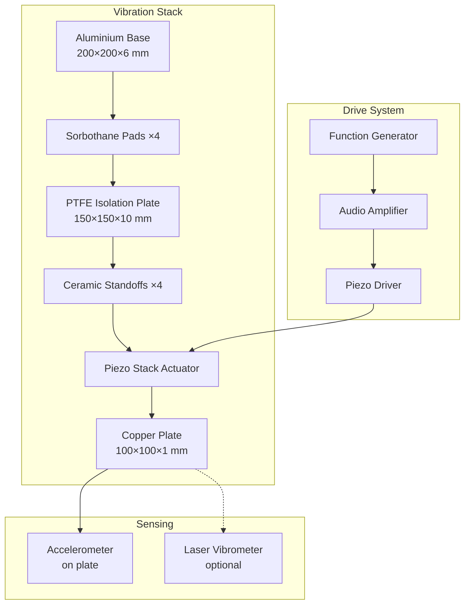

# Phase 2: Mechanical Assembly

> **Duration:** 2 weekends  
> **Cost:** £100-150  
> **Prerequisites:** Phase 1 complete, basic mechanical skills

---

## Objectives

1. Assemble piezoelectric vibration system
2. Mount and prepare copper plate
3. Build isolation mount
4. Verify mechanical performance
5. Characterize vibration amplitude vs. frequency

---

## Bill of Materials (Phase 2)

| Item | Qty | Est. Cost | Status |
|------|-----|-----------|--------|
| Piezo Stack Actuator (or DIY stack) | 1 | £80-180 | ☐ |
| Copper Sheet 100×100×1 mm | 1 | £15 | ☐ |
| PTFE Base Plate 150×150×10 mm | 1 | £8 | ☐ |
| Sorbothane Pads 50×50×6 mm | 4 | £12 | ☐ |
| Ceramic Standoffs M4×20 mm | 4 | £6 | ☐ |
| Aluminium Base Plate 200×200×6 mm | 1 | £15 | ☐ |
| Epoxy Adhesive (Araldite 2-part) | 1 | £8 | ☐ |
| M3/M4 Stainless Hardware | 1 set | £10 | ☐ |
| **Total** | | **~£155-255** | |

---

## Part 1: Vibration System Design

### 1.1 System Architecture



### 1.2 Design Rationale

**Why this stack order?**

1. **Aluminium base:** Provides mass and stability; thermally conductive for heat dissipation
2. **Sorbothane pads:** Isolate vibrations from bench; prevent acoustic coupling to sensors
3. **PTFE plate:** Electrical isolation; low dielectric loss; machinable
4. **Ceramic standoffs:** High voltage isolation; mechanical precision
5. **Piezo actuator:** Generates controlled displacement
6. **Copper plate:** High conductivity for charge distribution; easily polished

---

## Part 2: Piezo Actuator Options

### 2.1 Commercial Piezo Stack

**Recommended:** Thorlabs PK2FMP2 or equivalent

| Parameter | Specification |
|-----------|---------------|
| Free stroke | 9.1 μm @ 75V |
| Blocked force | 800 N |
| Capacitance | 380 nF |
| Resonant frequency | 140 kHz |
| Operating voltage | 0-75V |

**Advantages:** Precise, reliable, well-characterized  
**Disadvantages:** Expensive (£150+), limited displacement

### 2.2 DIY Piezo Stack

Build a stack from piezo disc elements for greater displacement at lower cost.

**Materials:**
- 10× piezo disc elements (27 mm diameter, brass-backed)
- Thin copper foil for electrodes
- Epoxy (non-conductive between electrodes, conductive for mechanical bond)

**Construction:**

```
        ┌──────────────────────────┐
        │      Copper Plate        │
        ├──────────────────────────┤  ─┐
        │     Piezo Disc 10        │   │
        │     + electrode          │   │
        ├──────────────────────────┤   │
        │     Piezo Disc 9         │   │
        │     - electrode          │   │
        ├──────────────────────────┤   │
        │          ...             │   │ Stack of 10 discs
        │                          │   │ wired in parallel
        ├──────────────────────────┤   │ (electrically)
        │     Piezo Disc 2         │   │ but in series
        │     + electrode          │   │ (mechanically)
        ├──────────────────────────┤   │
        │     Piezo Disc 1         │   │
        │     - electrode          │   │
        ├──────────────────────────┤  ─┘
        │      PTFE Base           │
        └──────────────────────────┘
```

**Wiring:** All positive electrodes connected together; all negative electrodes connected together. This gives:
- Displacement: Sum of individual displacements (~50-100 μm for 10 discs at 150V)
- Capacitance: Sum of individual capacitances (~200 nF)

**Disadvantages:** Less precise, requires careful construction, may have uneven displacement

### 2.3 Piezo Driver Circuit

The piezo stack requires a driver that can:
- Output 0-150V (for DIY stack) or 0-75V (for commercial)
- Handle capacitive load (100-400 nF)
- Follow audio-frequency signals (DC to 10 kHz)

**Simple Driver Circuit:**

```
                    +150V (from boost converter)
                       │
                       │
                    ┌──┴──┐
                    │     │
                    │ IRF │
                    │ 840 │  (N-channel MOSFET)
                    │     │
                    └──┬──┘
           ┌───────────┤
           │           │
       ┌───┴───┐       │
       │ 10kΩ  │       ├──────► To Piezo (+)
       └───┬───┘       │
           │        ┌──┴──┐
           │        │ 100Ω│  (Current sense)
   Audio ──┴──►     └──┬──┘
   Input              │
   (0-5V)             ▼
                     GND ◄─── Piezo (-)
                     
Note: This is a simplified schematic. 
See /hardware/schematics/piezo_driver/ for complete design.
```

**Alternative:** Use a commercial audio amplifier (50W+) with a step-up transformer.

---

## Part 3: Copper Plate Preparation

### 3.1 Plate Specifications

| Parameter | Value | Notes |
|-----------|-------|-------|
| Material | C101 (OFHC) Copper | Oxygen-free for best conductivity |
| Dimensions | 100 × 100 × 1 mm | Balance of area and mass |
| Surface finish | Mirror polish | For uniform charge distribution |
| Edge treatment | Rounded/deburred | Prevent corona at edges |
| Mass | ~89 g | Based on copper density 8.96 g/cm³ |

### 3.2 Plate Preparation Procedure

**Step 1: Inspection**
- Check for scratches, dents, or surface contamination
- Verify dimensions with calipers
- Check flatness on surface plate

**Step 2: Edge Treatment**
- Round all edges with fine file
- Radius should be ~1 mm minimum
- Sharp edges will cause preferential corona discharge

**Step 3: Surface Preparation**
```
1. Degrease with isopropyl alcohol
2. Wet sand with 400 grit, then 800, then 1200
3. Polish with metal polish (Brasso or similar)
4. Final clean with isopropyl alcohol
5. Handle only with clean gloves
```

**Step 4: Surface Verification**
- Visual inspection: should see clear reflection
- Wipe with clean white cloth: should show no residue
- Store in clean bag until assembly

### 3.3 Accelerometer Mounting

Mount ADXL345 accelerometer on plate centre:

```
                    ┌────────────────────────────────────┐
                    │                                    │
                    │                                    │
                    │                                    │
                    │          ┌──────────┐              │
                    │          │ ADXL345  │              │
                    │          │    ↑     │              │
                    │          │    Z     │              │
                    │          └──────────┘              │
                    │            Centre                  │
                    │                                    │
                    │                                    │
                    │                                    │
                    └────────────────────────────────────┘
                              100 mm
```

**Mounting method:**
1. Apply thin layer of cyanoacrylate to accelerometer bottom
2. Press firmly to plate centre
3. Ensure Z-axis is perpendicular to plate
4. Allow to cure 24 hours before testing
5. Route cable away from plate edge (HV clearance)

---

## Part 4: Assembly Procedure

### 4.1 Base Assembly

**Step 1: Prepare Aluminium Base**
- Clean thoroughly
- Mark positions for sorbothane pads (4 corners, 25 mm from edges)
- Drill mounting holes if using bolts

**Step 2: Install Sorbothane**
- Clean contact surfaces with IPA
- Apply sorbothane pads with adhesive backing
- Press firmly and allow to set

**Step 3: Mount PTFE Plate**
- Centre on sorbothane pads
- Secure with nylon screws through corners
- Do not over-tighten (PTFE is soft)

### 4.2 Piezo Stack Mounting

**Step 4: Install Ceramic Standoffs**
- Drill/tap M4 holes in PTFE plate (or use through-bolts)
- Install standoffs at positions matching piezo stack
- Verify standoffs are level

**Step 5: Mount Piezo Actuator**
- Clean mating surfaces
- Apply thin layer of thermal epoxy if heat dissipation needed
- Centre on standoffs
- Secure with appropriate fasteners

**Step 6: Attach Copper Plate**
- Clean piezo top surface
- Apply thin, even layer of epoxy to piezo top
- Centre copper plate on piezo
- Apply light pressure (book or small weight)
- Allow to cure 24 hours minimum

**Curing note:** Cure at room temperature. Higher temperatures may damage piezo.

### 4.3 Wiring

**Step 7: Piezo Wiring**
- Solder leads to piezo electrodes
- Use silicone-insulated wire (HV rated for HV side)
- Route cables away from sensor positions
- Add strain relief at mounting point

**Step 8: Accelerometer Wiring**
- Route I²C/SPI cable along support structure
- Keep away from piezo drive cables (interference)
- Use shielded cable if possible

---

## Part 5: Mechanical Testing

### 5.1 Resonance Characterization

Before HV operations, characterize the mechanical system:

**Procedure:**
1. Connect function generator → amplifier → piezo driver
2. Start with low amplitude (10% drive)
3. Sweep frequency from 10 Hz to 10 kHz
4. Monitor accelerometer output
5. Identify resonant frequencies (amplitude peaks)

**Expected Results:**
- First mechanical resonance: 500 Hz - 2 kHz (depends on mass/stiffness)
- Higher harmonics at integer multiples
- Anti-resonances (amplitude minima) between resonances

### 5.2 Amplitude Calibration

Create a calibration curve: drive voltage → displacement

**Method A: Calculate from Acceleration**
```
Displacement amplitude = Acceleration amplitude / (2πf)²

For sinusoidal motion:
x(t) = X₀ sin(2πft)
a(t) = -X₀(2πf)² sin(2πft)

Therefore: X₀ = A₀ / (2πf)²

Where:
X₀ = displacement amplitude (m)
A₀ = acceleration amplitude (m/s²)
f = frequency (Hz)
```

**Method B: Laser Measurement (if available)**
- Direct optical measurement of displacement
- More accurate, especially at high frequencies

### 5.3 Linearity Check

Verify linear response:
1. Fix frequency at 1 kHz
2. Vary drive amplitude: 10%, 25%, 50%, 75%, 100%
3. Record acceleration
4. Plot drive vs. acceleration
5. Should be linear (R² > 0.99)

Non-linearity indicates:
- Piezo saturation
- Mechanical coupling issues
- Driver distortion

### 5.4 Frequency Response Data

Record amplitude at standard frequencies:

| Frequency (Hz) | Drive (%) | Accel (g) | Displacement (μm) | Notes |
|----------------|-----------|-----------|-------------------|-------|
| 100 | 100 | | | |
| 200 | 100 | | | |
| 500 | 100 | | | |
| 1000 | 100 | | | |
| 2000 | 100 | | | |
| 5000 | 100 | | | |
| 10000 | 100 | | | |

---

## Part 6: Integration with Sensors

### 6.1 Position Verification

Install sensor array (from Phase 1) at target positions:

```
                Side View:
                
                ═══════════════════  Sensor mounting bar
                      │
                      │ (adjustable)
                      │
                ┌─────┴─────┐
                │ Sensor 1  │  ← 5 cm from plate
                └───────────┘
                      │
                      │ 5 cm
                      │
                ┌─────┴─────┐
                │ Sensor 2  │  ← 10 cm from plate
                └───────────┘
                      │
                      :
                      │
                ┌─────┴─────┐
                │  COPPER   │
                │   PLATE   │
                └───────────┘
                      │
                ┌─────┴─────┐
                │   PIEZO   │
                └───────────┘
                      │
                ══════╧══════  Base assembly
```

### 6.2 Vibration Coupling Check

Verify sensors are not mechanically coupled to vibration:

1. Run piezo at 1 kHz, 100% amplitude
2. Record magnetometer outputs
3. Compare to baseline (piezo off)
4. Vibration-coupled signal appears as:
   - Component at drive frequency
   - Component at 2× drive frequency (rectification)

**If coupling detected:**
- Increase sensor isolation
- Add sorbothane between sensor mount and structure
- Use longer, more flexible sensor cables

### 6.3 System Integration Test

Run full system test without HV:

1. Start data acquisition (all sensors)
2. Run through frequency sweep (100 Hz - 10 kHz)
3. Verify all data channels recording
4. Check for interference/artifacts
5. Generate test report

---

## Assembly Checklist

### Mechanical Assembly
- [ ] Base plate prepared and level
- [ ] Sorbothane isolation installed
- [ ] PTFE plate mounted and secure
- [ ] Ceramic standoffs installed and level
- [ ] Piezo actuator mounted
- [ ] Copper plate bonded and cured
- [ ] All edges deburred/rounded

### Wiring
- [ ] Piezo drive cables connected
- [ ] Accelerometer mounted and connected
- [ ] Cable routing away from sensors
- [ ] Strain relief on all cables
- [ ] Labels on all connections

### Testing
- [ ] Resonance frequencies identified
- [ ] Amplitude calibration complete
- [ ] Linearity verified
- [ ] Sensor coupling checked
- [ ] Integration test passed

---

## Troubleshooting

### Piezo Not Responding
- Check drive voltage reaching piezo
- Verify polarity
- Check for broken wire or cold solder joint
- Test piezo with multimeter (should show capacitance)

### Excessive Noise in Acceleration Signal
- Check accelerometer mounting (must be rigid)
- Add low-pass filter to signal
- Shield cables from piezo drive

### Non-Linear Response
- Reduce drive amplitude
- Check for mechanical binding
- Verify epoxy bond integrity
- Check driver circuit for distortion

### Resonance at Unexpected Frequency
- Check all mechanical connections tight
- Verify mass of copper plate
- Look for loose components
- Mounting may have changed effective stiffness

---

## Technical Drawings

See `/diagrams/` directory for:
- `mechanical-assembly.svg` - Exploded view
- `plate-dimensions.svg` - Copper plate drawing
- `mounting-detail.svg` - Piezo mounting detail

---

*Next: [Phase 3 - High Voltage Charging System](04-phase3-charging.md)*
