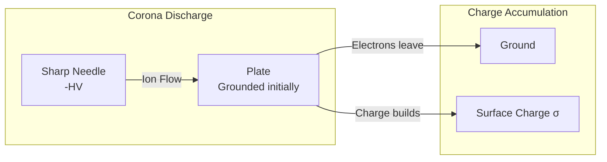
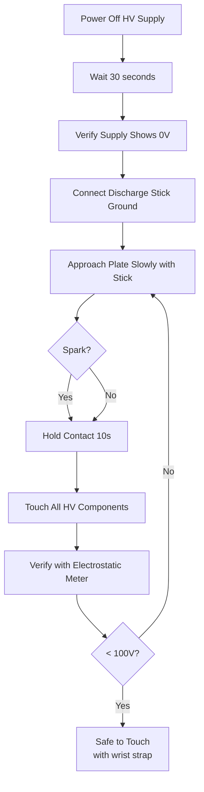

# Phase 3: High Voltage Charging System

> **Duration:** 2 weekends  
> **Cost:** £80-180  
> **Prerequisites:** Phase 1 & 2 complete, HV safety training  
> **⚠️ HIGH VOLTAGE - Review [SAFETY.md](SAFETY.md) before proceeding**

---

## Objectives

1. Build or acquire current-limited HV supply
2. Construct corona charging electrode
3. Build discharge safety system
4. Verify charging capability
5. Measure achievable charge density

---

## Bill of Materials (Phase 3)

| Item | Qty | Est. Cost | Status |
|------|-----|-----------|--------|
| HV Supply Module OR Cockcroft-Walton components | 1 | £50-150 | ☐ |
| HV Wire (silicone, 30kV rated) | 5m | £15 | ☐ |
| Tungsten Wire 0.1mm | 1m | £5 | ☐ |
| PTFE Rod 10mm diameter | 30cm | £5 | ☐ |
| Banana Plugs (HV rated) | 4 | £8 | ☐ |
| Current Limiting Resistors | 1 set | £10 | ☐ |
| HV Probe (1000:1) | 1 | £30 | ☐ |
| Discharge Stick Components | 1 set | £15 | ☐ |
| Warning Signs | 3 | £5 | ☐ |
| **Total** | | **~£145-245** | |

---

## ⚠️ Safety Review

**Before proceeding, confirm you have:**
- [ ] Read and understood [SAFETY.md](SAFETY.md) completely
- [ ] Another person available (present or on-call)
- [ ] Fire extinguisher within reach
- [ ] First aid kit present
- [ ] Discharge stick ready
- [ ] Insulating floor mat in place
- [ ] No jewellery worn
- [ ] Dry conditions (< 70% RH)

---

## Part 1: HV Supply Options

### 1.1 Option A: Commercial HV Module

**Recommended for:** First-time builders, quick setup

**Example modules:**
- eBay/AliExpress "negative ion generator" modules (3-10 kV)
- Scientific surplus HV supplies
- Photomultiplier tube supplies (modified)

**Requirements:**
| Parameter | Minimum | Preferred |
|-----------|---------|-----------|
| Output voltage | 10 kV | 20-30 kV |
| Output current | < 1 mA | < 0.5 mA |
| Polarity | Negative preferred | Switchable |
| Adjustment | Fixed OK | Variable |
| Current limiting | **REQUIRED** | Built-in |

**⚠️ CRITICAL:** The supply MUST be current-limited. Supplies capable of delivering > 1 mA at full voltage can cause lethal shocks and must have external current limiting added.

### 1.2 Option B: Cockcroft-Walton Multiplier

**Recommended for:** Learning HV principles, adjustable output

A Cockcroft-Walton voltage multiplier converts low-voltage AC to high-voltage DC through a diode-capacitor ladder.

```
                     AC Input (~1kV)
                          │
         ┌────────────────┴────────────────┐
         │                                 │
         │   ┌─────┐      ┌─────┐         │
         ├───┤ C1  ├───┬──┤ D1  ├────┐    │
         │   └─────┘   │  └─────┘    │    │
         │             │             │    │
         │   ┌─────┐   │  ┌─────┐    │    │
         │   │ D2  ├───┴──┤ C2  ├────┤    │
         │   └─────┘      └─────┘    │    │
         │                           │    │
         │   ┌─────┐      ┌─────┐    │    │
         ├───┤ C3  ├───┬──┤ D3  ├────┤    │
         │   └─────┘   │  └─────┘    │    │
         │             │             │    │
         │   ┌─────┐   │  ┌─────┐    │    │
         │   │ D4  ├───┴──┤ C4  ├────┤    │
         │   └─────┘      └─────┘    │    │
         │                           │    │
         :   (continue pattern)      :    :
         │                           │    │
         │                           ▼    │
         │                      HV Output │
         │                      (N × 2Vpk)│
         │                                │
         └────────────────────────────────┘
                                     │
                                    GND
```

**Output voltage:** V_out ≈ 2 × N × V_peak (AC input)

For 20 kV output from 1 kV AC input: N = 10 stages

**Components per stage:**
- 2× High voltage diodes (1N4007: 1kV, or UF4007 for faster recovery)
- 2× High voltage capacitors (10 nF, 1 kV ceramic)

**Total for 10-stage multiplier:**
- 20× diodes
- 20× capacitors

**AC Source options:**
- Neon sign transformer (10 kV, inherently current-limited) ✓
- Microwave oven transformer (2 kV, NOT current-limited) ⚠️
- Flyback transformer with driver circuit
- Variac + step-up transformer

### 1.3 Current Limiting

**CRITICAL SAFETY COMPONENT**

Add series resistance to limit current:

```
HV Supply ────┬──[R_limit]──┬──── Corona Electrode
              │             │
              │   ┌─────┐   │
              └───┤ HV  ├───┘
                  │Meter│ (optional)
                  └─────┘
```

**Resistance calculation:**
```
R_limit = V_max / I_safe

For V_max = 30 kV and I_safe = 0.5 mA:
R_limit = 30,000 / 0.0005 = 60 MΩ

Use: 6× 10 MΩ resistors in series
```

**Resistor requirements:**
- Voltage rating: > V_max / N_resistors
- Power rating: > I²R per resistor
- Type: Carbon film or metal oxide (NOT wirewound)

---

## Part 2: Corona Charging System

### 2.1 Principle of Operation

Corona discharge occurs when the electric field at a sharp point exceeds the breakdown strength of air (~3 MV/m). Ions created at the point are repelled toward the target (plate), depositing charge.



**Advantages of corona charging:**
- Non-contact (no wear)
- Self-limiting (charge spreads evenly)
- Works through air (no vacuum needed)

**Limitations:**
- Ozone production
- Charge leakage in humid air
- Limited charge density (~10-100 μC/m²)

### 2.2 Corona Electrode Construction

**Design:**
```
                     HV Input
                        │
                        │ HV Wire (inside rod)
                        │
         ┌──────────────┴──────────────┐
         │                             │
         │      PTFE Rod Handle        │
         │      (200mm × 10mm dia)     │
         │                             │
         └──────────────┬──────────────┘
                        │
                        │ HV Wire emerges
                        │
                   ┌────┴────┐
                   │ Tungsten │
                   │  Needle  │
                   │  (0.1mm) │
                   └────┬────┘
                        │
                        ▼
                    Sharp tip
                (point toward plate)
```

**Construction Steps:**

1. **Prepare PTFE rod:**
   - Cut to 200 mm length
   - Drill 2 mm hole through centre (for HV wire)
   - Round one end (handle)

2. **Install HV wire:**
   - Thread silicone-insulated HV wire through rod
   - Leave 10 mm exposed at tip end
   - Secure at handle end with heat shrink

3. **Attach needle:**
   - Cut 30 mm of tungsten wire
   - Solder or crimp to exposed HV wire
   - Sharpen tip if needed (use fine abrasive)

4. **Verify insulation:**
   - No exposed HV conductor except needle tip
   - Check for damage to wire insulation
   - Test with multimeter (should show open circuit handle-to-tip through PTFE)

### 2.3 Electrode Positioning

**Optimal corona geometry:**

```
        Corona Electrode
              │
              │
              ▼
         ┌────────┐
         │Needle  │
         │  tip   │
         └────┬───┘
              │
              │ Gap: 10-30 mm
              │
    ══════════╧══════════
    │                    │
    │    COPPER PLATE    │
    │                    │
    ══════════════════════
```

**Gap distance effects:**
| Gap | Corona onset | Charge rate | Uniformity |
|-----|--------------|-------------|------------|
| 5 mm | ~5 kV | Fast | Poor (centre hot spot) |
| 15 mm | ~10 kV | Medium | Good |
| 30 mm | ~15 kV | Slow | Excellent |
| 50 mm | ~20 kV | Very slow | Excellent |

**Recommendation:** Start with 20-30 mm gap, adjust based on results.

### 2.4 Mounting System

Mount electrode on adjustable arm:

```
         ┌─────────────────────────────────────┐
         │        Insulating Support Bar       │
         └───────────────┬─────────────────────┘
                         │
              ┌──────────┴──────────┐
              │  Adjustable Clamp   │
              │  (PTFE or acrylic)  │
              └──────────┬──────────┘
                         │
                    ┌────┴────┐
                    │  PTFE   │
                    │  Rod    │
                    │ (handle)│
                    └────┬────┘
                         │
                     Needle
                         │
                         ▼
                    ┌─────────┐
                    │  PLATE  │
                    └─────────┘
```

**Requirements:**
- All materials in HV path must be good insulators
- Adjustable height for gap optimization
- Stable (vibration from piezo should not affect gap)

---

## Part 3: Discharge Safety System

### 3.1 Discharge Stick

**NEVER touch any part of the HV system without first using the discharge stick.**

**Construction:**

```
         Handle (insulating)
         ┌──────────────────────────────┐
         │     Fibreglass/PTFE Rod      │
         │        (1m × 20mm)           │
         └──────────────┬───────────────┘
                        │
                   ┌────┴────┐
                   │ 10 MΩ   │  ← Limits discharge current
                   │Resistor │    (prevents loud spark)
                   │ Chain   │
                   └────┬────┘
                        │
                   ┌────┴────┐
                   │ Metal   │  ← Contact tip
                   │  Hook   │
                   └────┬────┘
                        │
                        │ Grounding Wire
                        │ (to mains earth)
                        ▼
                      Earth

```

**Components:**
- 1 m insulating rod (fibreglass, PTFE, or dry hardwood)
- 10× 1 MΩ resistors in series (or 2× 5 MΩ HV resistors)
- Metal hook or ball contact
- Flexible grounding wire (min 1.5 mm²)
- Earth connection (mains earth or ground rod)

### 3.2 Discharge Procedure



### 3.3 Grounding Strap

After discharge, wear a grounding wrist strap:

- Prevents static buildup on operator
- Provides continuous path to ground
- 1 MΩ resistor in strap limits current (safety)

---

## Part 4: System Integration

### 4.1 Complete HV System Diagram

```
┌─────────────────────────────────────────────────────────────────────┐
│                        FARADAY CAGE                                  │
│                                                                      │
│    ┌────────────┐                                                   │
│    │   Corona   │                                                   │
│    │ Electrode  │                                                   │
│    └─────┬──────┘                                                   │
│          │                                                          │
│          │ 20mm gap                                                 │
│          ▼                                                          │
│    ┌───────────┐        ┌───────────┐        ┌───────────┐         │
│    │   PLATE   │        │ Sensor 1  │        │ Sensor 2  │         │
│    │  (100×100)│        │  (5 cm)   │        │  (10 cm)  │         │
│    └─────┬─────┘        └───────────┘        └───────────┘         │
│          │                                                          │
│    ┌─────┴─────┐                                                    │
│    │   PIEZO   │                                                    │
│    │   STACK   │                                                    │
│    └─────┬─────┘                                                    │
│          │                                                          │
│    ══════╧══════ PTFE Isolation                                     │
│                                                                      │
└────────────────────────────────────────────────────────────────────┘
          │                    │
          │ HV Input           │ Signal cables
          │                    │ (BNC feedthrough)
          │                    │
┌─────────┴────────────────────┴───────────────────────────────────┐
│                     OUTSIDE CAGE                                  │
│                                                                   │
│   ┌────────────┐    ┌────────────┐    ┌────────────┐             │
│   │ HV Supply  │    │ Function   │    │  Arduino   │             │
│   │ (current   │    │ Generator  │    │    DAQ     │             │
│   │  limited)  │    │            │    │            │             │
│   └────────────┘    └────────────┘    └────────────┘             │
│                                                                   │
│   ┌────────────┐    ┌────────────┐                               │
│   │ Discharge  │    │ Reference  │                               │
│   │   Stick    │    │ Sensor 3   │                               │
│   └────────────┘    └────────────┘                               │
│                                                                   │
└───────────────────────────────────────────────────────────────────┘
```

### 4.2 Faraday Cage Construction

**Purpose:**
- Personnel safety (contains HV)
- EM shielding (reduces external interference)
- Defines experimental volume

**Construction:**

```
Materials:
- Copper mesh (100 mesh / 150 μm aperture)
- Aluminium angle (25×25 mm) for frame
- BNC feedthrough connectors
- HV feedthrough (or PTFE bushing)

Dimensions:
- 500 × 500 × 400 mm (internal)
- Access door on one side
- Feedthroughs on opposite side

Assembly:
1. Build frame from aluminium angle
2. Line with copper mesh (overlap joints by 20mm)
3. Solder or use conductive tape on all seams
4. Install feedthroughs
5. Add access door with finger stock gasket
6. Ground to mains earth
```

### 4.3 Feedthrough Installation

**BNC Signal Feedthroughs:**
- Panel-mount BNC connectors
- Ground shell to cage
- Use for sensor signals

**HV Feedthrough:**
- PTFE bushing with HV wire through centre
- Minimum 50 mm creepage distance
- Alternative: HV-rated connector (expensive)

```
          Outside          │  Cage Wall   │        Inside
                           │              │
    ════════════╦══════════╬══════════════╬══════════════
                ║          │              │
    HV Wire ────╫──────────│──PTFE────────│───── Corona
                ║          │  Bushing     │      Electrode
                ║          │              │
    ════════════╩══════════╬══════════════╬══════════════
                           │              │
                           │◄── 50mm ────►│
                           │   minimum    │
```

---

## Part 5: Charging Verification

### 5.1 Initial HV Test (No Plate)

**Before testing with the plate assembly:**

1. Set up HV supply outside cage
2. Connect to corona electrode
3. Ground the area where plate will be
4. Apply voltage slowly (variac if available)
5. Observe:
   - Corona onset voltage (faint blue glow at needle)
   - Corona sound (hissing/crackling)
   - Ozone smell (indicates discharge)

**Expected corona onset:** 5-15 kV depending on gap and needle sharpness

### 5.2 Charging Test

**Procedure:**

1. Ensure plate is isolated (floating)
2. Connect electrostatic voltmeter probe near plate
3. Apply HV to corona electrode
4. Monitor plate voltage rise
5. Record charging curve (voltage vs. time)

**Expected results:**
- Plate voltage rises toward corona voltage
- Rate depends on gap, humidity, needle condition
- Typical time to 80% of final: 10-60 seconds

### 5.3 Charge Density Estimation

**Calculating surface charge density:**

For a parallel-plate approximation:
```
σ = ε₀ × E = ε₀ × V/d

Where:
σ = surface charge density (C/m²)
ε₀ = 8.85 × 10⁻¹² F/m
V = plate voltage (V)
d = effective distance to ground (m)
```

**For our geometry:**
- Plate voltage: 10 kV
- Distance to grounded reference: ~0.1 m

```
σ ≈ 8.85 × 10⁻¹² × 10,000 / 0.1
σ ≈ 0.9 × 10⁻⁶ C/m²
σ ≈ 0.9 μC/m²
```

**Typical achievable values:** 1-50 μC/m² depending on conditions

### 5.4 Charge Decay Measurement

**Procedure:**

1. Charge plate to stable voltage
2. Turn off HV supply (do NOT discharge)
3. Monitor plate voltage decay over time
4. Record decay curve

**Decay mechanisms:**
- Surface leakage (humidity dependent)
- Air ionization
- Corona from edges

**Acceptable decay:** < 50% over 60 seconds in dry conditions

---

## Part 6: Integration Testing

### 6.1 Combined Operation Test

**First combined test (HV + vibration):**

1. Start data acquisition
2. Apply HV, verify plate charged
3. Start vibration at low amplitude, low frequency
4. Monitor for:
   - Corona changes (sound, light)
   - Charge stability
   - Sensor outputs
   - Any arcing or abnormal behavior

5. Gradually increase frequency and amplitude
6. Document behavior at each step

### 6.2 Operational Envelope

Map the safe operating region:

| Frequency | Max Amplitude | HV Voltage | Notes |
|-----------|---------------|------------|-------|
| 100 Hz | 100% | 20 kV | OK |
| 500 Hz | 100% | 20 kV | |
| 1 kHz | 100% | 20 kV | |
| 2 kHz | 100% | 20 kV | |
| 5 kHz | 100% | 20 kV | |
| 10 kHz | 100% | 20 kV | |

**Stop immediately if:**
- Arcing observed (not corona)
- Unusual sounds
- Smoke or burning smell
- Equipment overheating
- Sensor readings off scale

---

## Checklist: Phase 3 Complete

### Safety Systems
- [ ] Discharge stick built and tested
- [ ] Grounding wrist strap available
- [ ] Warning signs posted
- [ ] Emergency procedures documented
- [ ] Safety buddy system in place

### HV System
- [ ] HV supply tested at low current
- [ ] Current limiting verified (< 1 mA)
- [ ] Corona electrode constructed
- [ ] HV wiring secure and insulated
- [ ] Feedthrough installed

### Faraday Cage
- [ ] Frame constructed
- [ ] Mesh installed and grounded
- [ ] Feedthroughs installed
- [ ] Access door functional
- [ ] Seams sealed

### Verification
- [ ] Corona discharge observed
- [ ] Plate charging confirmed
- [ ] Charge density estimated
- [ ] Decay rate acceptable
- [ ] Combined operation tested

---

## Troubleshooting

### No Corona Discharge
- Increase voltage (may not have reached onset)
- Check needle sharpness (resharpen if corroded)
- Reduce gap distance
- Check all connections

### Arcing Instead of Corona
- Increase gap distance
- Check for sharp edges on plate
- Reduce voltage
- Inspect for contamination

### Rapid Charge Decay
- Reduce humidity (use dehumidifier or silica gel)
- Clean plate surface (oils cause leakage)
- Check for leakage paths (dust, contamination)
- Improve isolation (check PTFE condition)

### Corona from Plate Edges
- Ensure edges are well-rounded
- Apply corona dope (silicone grease) to edges
- Increase edge-to-electrode distance

---

*Next: [Phase 4 - Experimental Protocols](05-phase4-protocols.md)*
