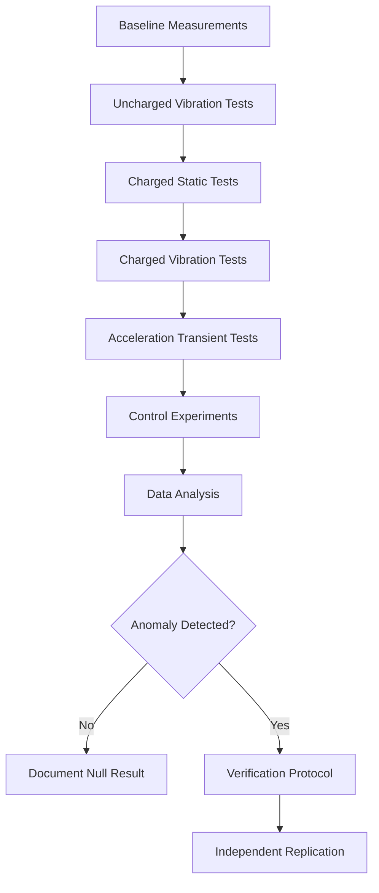

# Phase 4: Experimental Protocols

> **Duration:** 2 weekends  
> **Prerequisites:** Phases 1-3 complete, apparatus fully assembled

---

## Objectives

1. Establish standardised experimental procedures
2. Execute systematic test matrix
3. Implement control experiments
4. Document all results rigorously
5. Generate preliminary conclusions

---

## Experimental Design Overview



---

## Protocol 1: Baseline Measurement

### 1.1 Purpose
Establish noise floor and environmental characteristics without any experimental stimulus.

### 1.2 Setup
- Apparatus fully assembled but powered off
- All sensors recording
- No vibration, no HV
- Faraday cage closed

### 1.3 Procedure

```
Duration: 1 hour
Sample rate: 100 Hz
Conditions: Quiet period (evening/weekend)

Steps:
1. [ ] Close Faraday cage
2. [ ] Start data acquisition
3. [ ] Record start time and conditions
4. [ ] Leave undisturbed for 60 minutes
5. [ ] Stop acquisition
6. [ ] Record environmental conditions
7. [ ] Transfer data to analysis PC
```

### 1.4 Data Logging Template

```markdown
## Baseline Measurement Log

**Date:** YYYY-MM-DD
**Time:** HH:MM - HH:MM
**Operator:** [Name]

### Conditions
- Temperature: ___°C
- Humidity: ___%
- Barometric pressure: ___ hPa
- Weather: [Clear/Cloudy/Rain]
- Nearby activity: [None/Light/Heavy]

### Equipment Status
- [ ] All sensors responding
- [ ] SD card logging
- [ ] Serial streaming
- [ ] Faraday cage grounded

### Observations
[Any unusual events during recording]

### Files Generated
- `baseline_YYYYMMDD_HHMM.csv`
```

### 1.5 Expected Results
- Mean values near sensor offsets
- Standard deviation: 200-500 nT for HMC5883L
- Possible 50 Hz component from mains
- High correlation between sensors (environmental noise)

---

## Protocol 2: Uncharged Vibration Tests

### 2.1 Purpose
Characterise mechanical coupling and artifacts when plate vibrates without charge.

### 2.2 Setup
- Vibration system enabled
- HV system OFF (discharged)
- Corona electrode retracted or removed

### 2.3 Test Matrix

| Test ID | Frequency (Hz) | Amplitude (%) | Duration (s) |
|---------|----------------|---------------|--------------|
| UV-001 | 100 | 100 | 60 |
| UV-002 | 200 | 100 | 60 |
| UV-003 | 500 | 100 | 60 |
| UV-004 | 1000 | 100 | 60 |
| UV-005 | 2000 | 100 | 60 |
| UV-006 | 5000 | 100 | 60 |
| UV-007 | 10000 | 100 | 60 |
| UV-008 | 1000 | 25 | 60 |
| UV-009 | 1000 | 50 | 60 |
| UV-010 | 1000 | 75 | 60 |

### 2.4 Procedure

```
For each test in matrix:

1. [ ] Record test ID and parameters
2. [ ] Verify HV system discharged and off
3. [ ] Set function generator: frequency, amplitude 0%
4. [ ] Start data acquisition
5. [ ] Wait 10s (pre-stimulus baseline)
6. [ ] Ramp amplitude to target over 2s
7. [ ] Maintain for specified duration
8. [ ] Ramp amplitude to 0 over 2s
9. [ ] Wait 10s (post-stimulus baseline)
10. [ ] Stop acquisition
11. [ ] Save with test ID in filename
12. [ ] Log observations
```

### 2.5 Critical Observations

**Vibration coupling signature:**
- Signal at drive frequency in magnetometer
- Signal at 2× drive frequency (mechanical nonlinearity)
- Changes when sensor position is adjusted

**If coupling detected:**
- Document magnitude vs. frequency
- This becomes a correction factor for charged tests
- Improve isolation if excessive (> 10% of expected signal)

---

## Protocol 3: Charged Static Tests

### 3.1 Purpose
Verify charging system and measure static field from charged plate (no vibration).

### 3.2 Setup
- HV system enabled
- Vibration system OFF
- Corona electrode positioned

### 3.3 Test Matrix

| Test ID | Voltage (kV) | Duration (s) | Polarity |
|---------|--------------|--------------|----------|
| CS-001 | 5 | 120 | Negative |
| CS-002 | 10 | 120 | Negative |
| CS-003 | 15 | 120 | Negative |
| CS-004 | 20 | 120 | Negative |
| CS-005 | 20 | 120 | Positive |

### 3.4 Procedure

```
For each test:

⚠️ SAFETY: Follow HV procedures

1. [ ] Record test ID and parameters
2. [ ] Verify vibration system OFF
3. [ ] Position corona electrode (20mm gap)
4. [ ] Start data acquisition
5. [ ] Wait 10s (baseline)
6. [ ] Slowly raise HV to target voltage
7. [ ] Maintain for specified duration
8. [ ] Monitor charge stability
9. [ ] Reduce HV to zero
10. [ ] Discharge plate using stick
11. [ ] Wait 10s (post-discharge baseline)
12. [ ] Stop acquisition
13. [ ] Log observations
```

### 3.5 Expected Results

**Classical prediction:**
A static charged plate produces an electric field but no magnetic field.

**What to look for:**
- Step change in magnetometer during charge/discharge? → Investigate
- Correlation with charge level? → Investigate
- Constant offset unrelated to charge? → Likely artifact

---

## Protocol 4: Charged Vibration Tests

### 4.1 Purpose
The primary experiment: test for anomalous EM field from vibrating charged plate.

### 4.2 Setup
- Both HV and vibration systems enabled
- All sensors recording
- Full safety protocols

### 4.3 Test Matrix

**Frequency Sweep at Fixed Charge:**

| Test ID | Voltage (kV) | Frequency (Hz) | Amplitude (%) | Duration (s) |
|---------|--------------|----------------|---------------|--------------|
| CV-001 | 15 | 100 | 100 | 60 |
| CV-002 | 15 | 200 | 100 | 60 |
| CV-003 | 15 | 500 | 100 | 60 |
| CV-004 | 15 | 1000 | 100 | 60 |
| CV-005 | 15 | 2000 | 100 | 60 |
| CV-006 | 15 | 5000 | 100 | 60 |
| CV-007 | 15 | 10000 | 100 | 60 |

**Charge Sweep at Fixed Frequency:**

| Test ID | Voltage (kV) | Frequency (Hz) | Amplitude (%) | Duration (s) |
|---------|--------------|----------------|---------------|--------------|
| CV-008 | 5 | 1000 | 100 | 60 |
| CV-009 | 10 | 1000 | 100 | 60 |
| CV-010 | 15 | 1000 | 100 | 60 |
| CV-011 | 20 | 1000 | 100 | 60 |

### 4.4 Procedure

```
For each test:

⚠️ SAFETY: Full HV and mechanical protocols

PREPARATION:
1. [ ] Record test ID and all parameters
2. [ ] Set function generator: target frequency, amplitude 0%
3. [ ] Position corona electrode

EXECUTION:
4. [ ] Start data acquisition
5. [ ] Wait 10s (baseline)
6. [ ] Raise HV to target, wait for charge stability (30s)
7. [ ] Ramp vibration amplitude to target over 2s
8. [ ] Maintain for specified duration
9. [ ] Ramp vibration to 0 over 2s
10. [ ] Reduce HV to zero
11. [ ] Discharge plate
12. [ ] Wait 10s (post-test baseline)
13. [ ] Stop acquisition

POST-TEST:
14. [ ] Save data with test ID
15. [ ] Log all observations
16. [ ] Note any anomalies
```

### 4.5 Data Analysis Focus

For each test, compare:

**Signal during charged vibration** vs **uncharged vibration at same parameters**

```
Signal_anomaly = Signal_CV - Signal_UV

If |Signal_anomaly| > 3 × Noise_floor:
    → Potential detection (requires verification)
```

**Scaling analysis:**

According to patent, look for:
- Signal ∝ σ (charge density) → Linear with voltage
- Signal ∝ ν³ (frequency cubed) → Strong frequency dependence

---

## Protocol 5: Acceleration Transient Tests

### 5.1 Purpose
Test the specific claim that rapid acceleration transients produce enhanced fields.

### 5.2 Transient Profiles

**Profile A: Step Start**
```
Amplitude
    │
100%│         ┌────────────────
    │         │
 50%│         │
    │         │
  0%│─────────┘
    └─────────┬────────────────► Time
              t=0
              (instantaneous start)
```

**Profile B: Frequency Chirp**
```
Frequency
    │
 5kHz│                    ╱
    │                  ╱
 1kHz│              ╱
    │          ╱
100Hz│_________╱
    └──────────────────────────► Time
         (linear frequency ramp)
```

**Profile C: Burst Oscillation**
```
Amplitude
    │
100%│  ████  ████  ████  ████
    │  ████  ████  ████  ████
  0%│──    ──    ──    ──    ──
    └──────────────────────────► Time
       (bursts of 10 cycles)
```

### 5.3 Test Matrix

| Test ID | Profile | Base Freq (Hz) | Charge (kV) | Notes |
|---------|---------|----------------|-------------|-------|
| AT-001 | Step Start | 1000 | 15 | Instantaneous on |
| AT-002 | Step Stop | 1000 | 15 | Instantaneous off |
| AT-003 | Chirp Up | 100→5000 | 15 | 5s sweep |
| AT-004 | Chirp Down | 5000→100 | 15 | 5s sweep |
| AT-005 | Burst | 1000 | 15 | 10 cycles on, 10 off |
| AT-006 | Pulse | 1000 | 15 | Single cycle pulses |

### 5.4 Analysis Focus

Look for:
- Transient spikes at start/stop of motion
- Enhanced signal during frequency transitions
- Correlation between dω/dt and field magnitude

---

## Protocol 6: Control Experiments

### 6.1 Purpose
Systematically eliminate mundane explanations for any observed signals.

### 6.2 Control Matrix

| Control ID | Description | Tests |
|------------|-------------|-------|
| CTRL-001 | Mechanical coupling | Vibrate uncharged plate |
| CTRL-002 | Capacitive coupling | Charge plate, vibrate nearby object |
| CTRL-003 | Inductive pickup | Move piezo cables, no plate motion |
| CTRL-004 | Ground loops | Vary grounding configuration |
| CTRL-005 | Sensor artifact | Shield sensor, repeat test |
| CTRL-006 | Environmental | Compare to external reference sensor |

### 6.3 Control: Mechanical Coupling (CTRL-001)

Already covered in Protocol 2 (Uncharged Vibration Tests).

**Pass criteria:** Signal during charged vibration exceeds uncharged by > 3σ after subtracting mechanical coupling.

### 6.4 Control: Capacitive Coupling (CTRL-002)

**Setup:**
- Charge plate normally
- Do NOT vibrate plate
- Vibrate a separate neutral object near sensors

**Pass criteria:** No signal correlated with vibration.

**If fail:** Sensors are picking up electric field oscillation, not magnetic. Need better E-field shielding.

### 6.5 Control: Inductive Pickup (CTRL-003)

**Setup:**
- Disconnect piezo from plate
- Drive piezo amplifier at normal levels
- Move piezo cables to different routings

**Pass criteria:** No signal correlated with drive frequency.

**If fail:** Magnetic field from drive currents is coupling to sensors. Improve cable shielding and routing.

### 6.6 Control: Ground Loops (CTRL-004)

**Setup:**
- Vary grounding configuration:
  - All grounds at single point (star)
  - Multiple ground points
  - Isolated sensor power (battery)

**Pass criteria:** Signal unchanged by grounding variation.

**If fail:** Ground loop artifact. Implement star grounding, use isolated supplies.

### 6.7 Control: Sensor Artifact (CTRL-005)

**Setup:**
- Place mu-metal shield around sensor
- Repeat main experiment

**Pass criteria:** Signal reduced by > 10× (shielding factor) if real magnetic field, unchanged if artifact.

### 6.8 Control: Environmental (CTRL-006)

**Analysis:**
- Compare signal timing with reference sensor outside cage
- Correlate with environmental events (HVAC, traffic)

**Pass criteria:** Signal uncorrelated with external sensor.

---

## Data Management

### File Naming Convention

```
{Protocol}_{TestID}_{Date}_{Time}.csv

Examples:
- BL_001_20240115_1430.csv  (Baseline)
- UV_003_20240115_1445.csv  (Uncharged Vibration)
- CV_007_20240115_1520.csv  (Charged Vibration)
- AT_002_20240115_1600.csv  (Acceleration Transient)
```

### Directory Structure

```
data/
├── raw/
│   ├── baseline/
│   ├── uncharged_vibration/
│   ├── charged_static/
│   ├── charged_vibration/
│   ├── acceleration_transient/
│   └── controls/
├── processed/
│   ├── calibrated/
│   └── analyzed/
├── logs/
│   ├── session_logs/
│   └── equipment_logs/
└── results/
    ├── figures/
    └── reports/
```

### Session Log Template

```markdown
# Experimental Session Log

**Date:** YYYY-MM-DD
**Time:** HH:MM - HH:MM
**Operator(s):** [Names]
**Session ID:** SESSION_YYYYMMDD_001

## Equipment Status
- [ ] Sensors calibrated (date: ___)
- [ ] HV supply tested (max V: ___ kV)
- [ ] Piezo response verified
- [ ] SD card space: ___ GB free
- [ ] Safety equipment checked

## Environmental Conditions
| Time | Temp (°C) | Humidity (%) | Notes |
|------|-----------|--------------|-------|
| Start | | | |
| End | | | |

## Tests Conducted
| Test ID | Protocol | Start Time | Status | Notes |
|---------|----------|------------|--------|-------|
| | | | | |

## Observations
[Free-form notes on anything unusual]

## Issues Encountered
[Any problems and how they were resolved]

## Data Files Generated
[List all files created this session]

## Next Session Actions
[What needs to be done next time]
```

---

## Success Criteria

### For Null Result (Effect Not Detected)

Document:
- [ ] All test matrix completed
- [ ] All controls passed
- [ ] Noise floor characterised
- [ ] Parameter space covered
- [ ] Upper bound on effect size established

**Reportable conclusion:** "No anomalous magnetic field detected from vibrating charged plate within the parameter space tested. Upper bound on any effect is X nT at Y Hz, Z kV."

### For Anomaly Detection

Required verification:
- [ ] Effect > 3σ above noise floor
- [ ] Effect reproducible (> 5 consecutive trials)
- [ ] Effect scales with expected parameter (charge or frequency)
- [ ] All controls passed
- [ ] Effect persists with equipment variations
- [ ] Independent operator replication

**If all verified:** Proceed to external replication before any claims.

---

## Quick Reference Card

Print and post near apparatus:

```
╔══════════════════════════════════════════════════╗
║         PAIS EFFECT DEMONSTRATOR                 ║
║            QUICK REFERENCE                       ║
╠══════════════════════════════════════════════════╣
║                                                  ║
║  BEFORE ANY HV OPERATION:                        ║
║  □ Safety buddy present/on-call                  ║
║  □ Discharge stick ready                         ║
║  □ Fire extinguisher accessible                  ║
║  □ No jewellery worn                             ║
║                                                  ║
║  STANDARD TEST SEQUENCE:                         ║
║  1. Start DAQ                                    ║
║  2. 10s baseline                                 ║
║  3. Apply HV (wait 30s for stability)            ║
║  4. Ramp vibration (2s)                          ║
║  5. Hold (60s)                                   ║
║  6. Ramp vibration off (2s)                      ║
║  7. HV off                                       ║
║  8. DISCHARGE PLATE                              ║
║  9. 10s post-baseline                            ║
║  10. Stop DAQ                                    ║
║                                                  ║
║  EMERGENCY: Kill HV, evacuate, call for help     ║
║                                                  ║
╚══════════════════════════════════════════════════╝
```

---

*Next: [Phase 5 - Data Analysis](06-phase5-analysis.md)*
