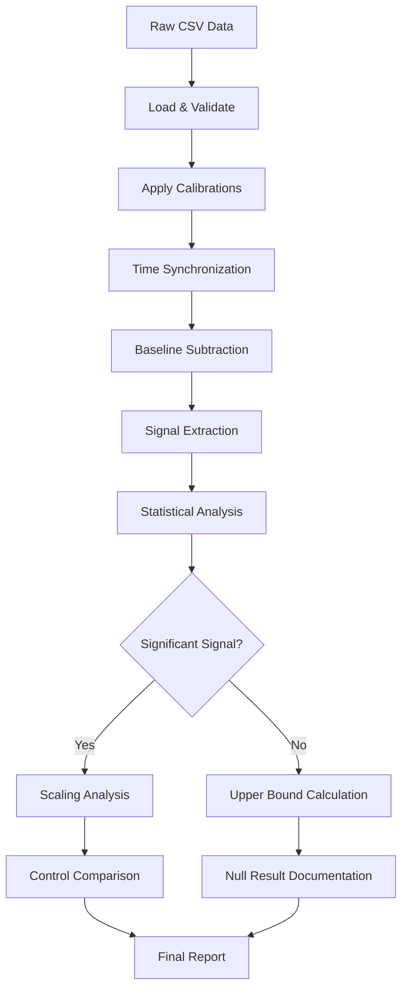

# Phase 5: Data Analysis

> **Duration:** Ongoing  
> **Prerequisites:** Data from Phase 4 experiments

---

## Objectives

1. Process raw sensor data
2. Apply calibration corrections
3. Perform statistical analysis
4. Test for anomalous signals
5. Generate publication-quality results

---

## Analysis Pipeline Overview



---

## Part 1: Data Loading and Validation

### 1.1 Data Format

Raw CSV structure from DAQ:
```csv
timestamp_us,m1x,m1y,m1z,m2x,m2y,m2z,m3x,m3y,m3z,ax,ay,az
1000000,125,-43,2048,130,-45,2052,128,-42,2050,0,0,256
1010000,126,-42,2047,131,-44,2051,129,-43,2049,5,2,258
...
```

### 1.2 Data Loader

```python
#!/usr/bin/env python3
"""
data_loader.py - Load and validate experimental data
"""

import pandas as pd
import numpy as np
from pathlib import Path
from dataclasses import dataclass
from typing import Optional, Tuple

@dataclass
class ExperimentMetadata:
    """Metadata for an experiment"""
    test_id: str
    protocol: str
    date: str
    frequency_hz: Optional[float] = None
    voltage_kv: Optional[float] = None
    amplitude_pct: Optional[float] = None
    duration_s: Optional[float] = None
    notes: str = ""

def load_experiment(filepath: str) -> Tuple[pd.DataFrame, ExperimentMetadata]:
    """
    Load experiment data and extract metadata from filename.
    
    Filename format: {Protocol}_{TestID}_{Date}_{Time}.csv
    Example: CV_007_20240115_1520.csv
    """
    path = Path(filepath)
    
    # Parse filename
    parts = path.stem.split('_')
    protocol = parts[0] if len(parts) > 0 else "UNKNOWN"
    test_id = parts[1] if len(parts) > 1 else "000"
    date = parts[2] if len(parts) > 2 else "00000000"
    
    metadata = ExperimentMetadata(
        test_id=f"{protocol}_{test_id}",
        protocol=protocol,
        date=date
    )
    
    # Load data
    df = pd.read_csv(filepath)
    
    # Validate columns
    required_cols = ['timestamp_us', 'm1x', 'm1y', 'm1z', 'ax', 'ay', 'az']
    missing = set(required_cols) - set(df.columns)
    if missing:
        raise ValueError(f"Missing columns: {missing}")
    
    # Add derived columns
    df['time_s'] = (df['timestamp_us'] - df['timestamp_us'].iloc[0]) / 1e6
    
    # Calculate magnitude for each sensor
    for sensor in ['m1', 'm2', 'm3']:
        if all(f'{sensor}{ax}' in df.columns for ax in 'xyz'):
            df[f'{sensor}_mag'] = np.sqrt(
                df[f'{sensor}x']**2 + 
                df[f'{sensor}y']**2 + 
                df[f'{sensor}z']**2
            )
    
    # Calculate acceleration magnitude
    df['acc_mag'] = np.sqrt(df['ax']**2 + df['ay']**2 + df['az']**2)
    
    return df, metadata

def validate_data(df: pd.DataFrame) -> dict:
    """
    Perform data quality checks.
    Returns dict of quality metrics.
    """
    quality = {}
    
    # Check for gaps in timestamps
    dt = np.diff(df['timestamp_us'])
    expected_dt = np.median(dt)
    gaps = np.sum(dt > 2 * expected_dt)
    quality['timestamp_gaps'] = gaps
    quality['sample_rate_hz'] = 1e6 / expected_dt
    
    # Check for saturated values (HMC5883L saturates at ±2048)
    for col in ['m1x', 'm1y', 'm1z', 'm2x', 'm2y', 'm2z', 'm3x', 'm3y', 'm3z']:
        if col in df.columns:
            saturated = np.sum(np.abs(df[col]) >= 2047)
            quality[f'{col}_saturated'] = saturated
    
    # Check for NaN values
    quality['nan_count'] = df.isna().sum().sum()
    
    # Duration
    quality['duration_s'] = df['time_s'].iloc[-1]
    quality['sample_count'] = len(df)
    
    return quality
```

---

## Part 2: Calibration

### 2.1 Magnetometer Calibration

```python
"""
calibration.py - Apply sensor calibrations
"""

import numpy as np
import pandas as pd
from dataclasses import dataclass

@dataclass
class MagnetometerCalibration:
    """Calibration parameters for a magnetometer"""
    offset_x: float
    offset_y: float
    offset_z: float
    scale_x: float
    scale_y: float
    scale_z: float
    # Sensitivity: LSB per Tesla (HMC5883L at gain 1 = 1090 LSB/Gauss = 10900 LSB/mT)
    sensitivity: float = 10900.0  # LSB per mT

# Default calibrations (replace with measured values)
DEFAULT_CAL = {
    'm1': MagnetometerCalibration(0, 0, 0, 1, 1, 1),
    'm2': MagnetometerCalibration(0, 0, 0, 1, 1, 1),
    'm3': MagnetometerCalibration(0, 0, 0, 1, 1, 1),
}

def apply_calibration(df: pd.DataFrame, calibrations: dict = None) -> pd.DataFrame:
    """
    Apply calibration to magnetometer data.
    Converts LSB to microtesla (μT).
    """
    if calibrations is None:
        calibrations = DEFAULT_CAL
    
    df_cal = df.copy()
    
    for sensor, cal in calibrations.items():
        for axis in ['x', 'y', 'z']:
            col = f'{sensor}{axis}'
            if col not in df.columns:
                continue
            
            offset = getattr(cal, f'offset_{axis}')
            scale = getattr(cal, f'scale_{axis}')
            
            # Apply offset and scale
            df_cal[f'{col}_cal'] = (df[col] - offset) * scale
            
            # Convert to microtesla
            # 1 Gauss = 100 μT, sensitivity is in LSB/Gauss
            df_cal[f'{col}_uT'] = df_cal[f'{col}_cal'] / (cal.sensitivity / 100)
    
    # Recalculate magnitudes in physical units
    for sensor in ['m1', 'm2', 'm3']:
        if all(f'{sensor}{ax}_uT' in df_cal.columns for ax in 'xyz'):
            df_cal[f'{sensor}_mag_uT'] = np.sqrt(
                df_cal[f'{sensor}x_uT']**2 + 
                df_cal[f'{sensor}y_uT']**2 + 
                df_cal[f'{sensor}z_uT']**2
            )
    
    return df_cal

def calibrate_from_tumble(data: pd.DataFrame, sensor: str) -> MagnetometerCalibration:
    """
    Calculate calibration from tumble test data.
    
    During tumble test, sensor is rotated through all orientations.
    Min/max values give offset and scale.
    """
    offsets = {}
    scales = {}
    
    for axis in ['x', 'y', 'z']:
        col = f'{sensor}{axis}'
        min_val = data[col].min()
        max_val = data[col].max()
        
        offsets[axis] = (max_val + min_val) / 2
        scales[axis] = (max_val - min_val) / 2
    
    # Normalize scales to average
    avg_scale = np.mean(list(scales.values()))
    norm_scales = {ax: avg_scale / scales[ax] for ax in 'xyz'}
    
    return MagnetometerCalibration(
        offset_x=offsets['x'],
        offset_y=offsets['y'],
        offset_z=offsets['z'],
        scale_x=norm_scales['x'],
        scale_y=norm_scales['y'],
        scale_z=norm_scales['z']
    )
```

### 2.2 Accelerometer Calibration

```python
@dataclass
class AccelerometerCalibration:
    """Calibration for ADXL345"""
    offset_x: float
    offset_y: float
    offset_z: float
    # ADXL345 at ±16g, full resolution: 3.9 mg/LSB
    sensitivity: float = 3.9  # mg per LSB

def apply_accel_calibration(df: pd.DataFrame, cal: AccelerometerCalibration = None) -> pd.DataFrame:
    """Convert accelerometer readings to m/s²"""
    if cal is None:
        cal = AccelerometerCalibration(0, 0, 0)
    
    df_cal = df.copy()
    
    for axis in ['x', 'y', 'z']:
        col = f'a{axis}'
        offset = getattr(cal, f'offset_{axis}')
        
        # Apply offset and convert to m/s²
        # 1g = 9.81 m/s², sensitivity in mg/LSB
        df_cal[f'{col}_ms2'] = (df[col] - offset) * cal.sensitivity * 9.81 / 1000
    
    df_cal['acc_mag_ms2'] = np.sqrt(
        df_cal['ax_ms2']**2 + 
        df_cal['ay_ms2']**2 + 
        df_cal['az_ms2']**2
    )
    
    return df_cal
```

---

## Part 3: Signal Processing

### 3.1 Baseline Subtraction

```python
"""
signal_processing.py - Signal extraction and processing
"""

import numpy as np
import pandas as pd
from scipy import signal
from scipy.fft import fft, fftfreq

def extract_baseline(df: pd.DataFrame, 
                     pre_window: Tuple[float, float] = (0, 10),
                     post_window: Tuple[float, float] = None) -> dict:
    """
    Extract baseline statistics from pre/post stimulus periods.
    
    Parameters:
        df: DataFrame with 'time_s' column
        pre_window: (start, end) in seconds for pre-stimulus baseline
        post_window: (start, end) in seconds for post-stimulus baseline
                     If None, uses last 10 seconds
    
    Returns:
        dict with mean and std for each sensor channel
    """
    baseline = {}
    
    # Pre-stimulus baseline
    mask_pre = (df['time_s'] >= pre_window[0]) & (df['time_s'] < pre_window[1])
    
    # Post-stimulus baseline
    if post_window is None:
        max_t = df['time_s'].max()
        post_window = (max_t - 10, max_t)
    mask_post = (df['time_s'] >= post_window[0]) & (df['time_s'] < post_window[1])
    
    for col in df.columns:
        if col.startswith('m') and col.endswith('_uT'):
            pre_mean = df.loc[mask_pre, col].mean()
            pre_std = df.loc[mask_pre, col].std()
            post_mean = df.loc[mask_post, col].mean()
            post_std = df.loc[mask_post, col].std()
            
            baseline[col] = {
                'pre_mean': pre_mean,
                'pre_std': pre_std,
                'post_mean': post_mean,
                'post_std': post_std,
                'combined_mean': (pre_mean + post_mean) / 2,
                'combined_std': np.sqrt(pre_std**2 + post_std**2) / 2
            }
    
    return baseline

def subtract_baseline(df: pd.DataFrame, baseline: dict) -> pd.DataFrame:
    """Subtract baseline mean from each channel."""
    df_sub = df.copy()
    
    for col, stats in baseline.items():
        if col in df.columns:
            df_sub[f'{col}_sub'] = df[col] - stats['combined_mean']
    
    return df_sub
```

### 3.2 Frequency Analysis

```python
def compute_spectrum(df: pd.DataFrame, column: str, fs: float = 100) -> Tuple[np.ndarray, np.ndarray]:
    """
    Compute power spectral density using Welch's method.
    
    Returns:
        frequencies, psd
    """
    data = df[column].values
    f, psd = signal.welch(data, fs, nperseg=min(1024, len(data)//4))
    return f, psd

def compute_spectrogram(df: pd.DataFrame, column: str, fs: float = 100) -> Tuple[np.ndarray, np.ndarray, np.ndarray]:
    """
    Compute spectrogram for time-frequency analysis.
    
    Returns:
        frequencies, times, Sxx (power)
    """
    data = df[column].values
    f, t, Sxx = signal.spectrogram(data, fs, nperseg=256, noverlap=128)
    return f, t, Sxx

def extract_frequency_component(df: pd.DataFrame, column: str, 
                                 target_freq: float, fs: float = 100,
                                 bandwidth: float = 5) -> pd.DataFrame:
    """
    Extract component at specific frequency using bandpass filter.
    
    Parameters:
        target_freq: Center frequency in Hz
        bandwidth: Total bandwidth in Hz
    
    Returns:
        DataFrame with filtered signal and envelope
    """
    data = df[column].values
    
    # Design bandpass filter
    low = (target_freq - bandwidth/2) / (fs/2)
    high = (target_freq + bandwidth/2) / (fs/2)
    
    # Ensure valid filter frequencies
    low = max(0.01, min(low, 0.99))
    high = max(low + 0.01, min(high, 0.99))
    
    b, a = signal.butter(4, [low, high], btype='band')
    
    # Apply filter
    filtered = signal.filtfilt(b, a, data)
    
    # Compute envelope using Hilbert transform
    analytic = signal.hilbert(filtered)
    envelope = np.abs(analytic)
    
    result = df[['time_s']].copy()
    result[f'{column}_filt_{target_freq}Hz'] = filtered
    result[f'{column}_env_{target_freq}Hz'] = envelope
    
    return result
```

---

## Part 4: Statistical Analysis

### 4.1 Detection Statistics

```python
"""
statistics.py - Statistical analysis for signal detection
"""

import numpy as np
from scipy import stats
from typing import Tuple, Optional

def detection_statistics(signal_period: np.ndarray, 
                         baseline_period: np.ndarray) -> dict:
    """
    Calculate detection statistics comparing signal to baseline.
    
    Returns dict with:
        - mean_diff: Difference in means
        - std_baseline: Standard deviation of baseline
        - snr: Signal-to-noise ratio
        - t_stat: Student's t statistic
        - p_value: p-value for difference
        - significant: Whether p < 0.05
        - sigma_level: Detection significance in sigma
    """
    mean_signal = np.mean(signal_period)
    mean_baseline = np.mean(baseline_period)
    std_baseline = np.std(baseline_period)
    
    mean_diff = mean_signal - mean_baseline
    snr = mean_diff / std_baseline if std_baseline > 0 else 0
    
    # Two-sample t-test
    t_stat, p_value = stats.ttest_ind(signal_period, baseline_period)
    
    # Convert to sigma level
    sigma_level = np.abs(stats.norm.ppf(p_value / 2)) if p_value > 0 else np.inf
    
    return {
        'mean_signal': mean_signal,
        'mean_baseline': mean_baseline,
        'mean_diff': mean_diff,
        'std_baseline': std_baseline,
        'std_signal': np.std(signal_period),
        'snr': snr,
        't_stat': t_stat,
        'p_value': p_value,
        'significant': p_value < 0.05,
        'sigma_level': sigma_level
    }

def calculate_upper_bound(baseline_std: float, 
                           confidence: float = 0.95,
                           n_samples: int = 1000) -> float:
    """
    Calculate upper bound on signal if nothing detected.
    
    Uses one-sided confidence interval.
    
    Returns upper bound in same units as baseline_std.
    """
    # Critical value for one-sided test
    z = stats.norm.ppf(confidence)
    
    # Standard error of mean
    sem = baseline_std / np.sqrt(n_samples)
    
    # Upper bound
    return z * sem
```

### 4.2 Scaling Analysis

```python
def fit_power_law(x: np.ndarray, y: np.ndarray) -> Tuple[float, float, float]:
    """
    Fit y = A * x^n power law using log-log regression.
    
    Returns:
        n: Power law exponent
        A: Coefficient
        r_squared: Goodness of fit
    """
    # Remove zeros and negatives
    mask = (x > 0) & (y > 0)
    x_clean = x[mask]
    y_clean = y[mask]
    
    if len(x_clean) < 2:
        return np.nan, np.nan, np.nan
    
    # Log-log regression
    log_x = np.log(x_clean)
    log_y = np.log(y_clean)
    
    slope, intercept, r_value, p_value, std_err = stats.linregress(log_x, log_y)
    
    n = slope
    A = np.exp(intercept)
    r_squared = r_value**2
    
    return n, A, r_squared

def test_pais_scaling(frequencies: np.ndarray, signals: np.ndarray) -> dict:
    """
    Test if signal follows Pais prediction (ν³) vs classical (ν²).
    
    Returns comparison of fits.
    """
    # Fit power law
    n_fit, A_fit, r2_fit = fit_power_law(frequencies, signals)
    
    # Calculate residuals for ν² (classical)
    classical_pred = frequencies**2
    classical_pred = classical_pred * np.mean(signals) / np.mean(classical_pred)
    classical_residuals = np.sum((signals - classical_pred)**2)
    
    # Calculate residuals for ν³ (Pais)
    pais_pred = frequencies**3
    pais_pred = pais_pred * np.mean(signals) / np.mean(pais_pred)
    pais_residuals = np.sum((signals - pais_pred)**2)
    
    return {
        'fitted_exponent': n_fit,
        'fitted_coefficient': A_fit,
        'fit_r_squared': r2_fit,
        'classical_exponent': 2,
        'pais_exponent': 3,
        'classical_residuals': classical_residuals,
        'pais_residuals': pais_residuals,
        'favors_pais': pais_residuals < classical_residuals,
        'residual_ratio': classical_residuals / pais_residuals if pais_residuals > 0 else np.inf
    }
```

---

## Part 5: Visualization

### 5.1 Standard Plots

```python
"""
visualization.py - Standard plots for analysis
"""

import numpy as np
import pandas as pd
import matplotlib.pyplot as plt
from matplotlib.gridspec import GridSpec

def plot_experiment_overview(df: pd.DataFrame, 
                              baseline: dict,
                              title: str = "Experiment Overview") -> plt.Figure:
    """
    Create standard 4-panel experiment overview plot.
    
    Panels:
        1. Time series (all magnetometers)
        2. Acceleration
        3. PSD
        4. Detection statistics
    """
    fig = plt.figure(figsize=(14, 10))
    gs = GridSpec(2, 2, figure=fig)
    
    # Panel 1: Magnetometer time series
    ax1 = fig.add_subplot(gs[0, 0])
    for sensor in ['m1', 'm2', 'm3']:
        col = f'{sensor}_mag_uT'
        if col in df.columns:
            ax1.plot(df['time_s'], df[col], label=sensor.upper(), alpha=0.7)
    ax1.set_xlabel('Time (s)')
    ax1.set_ylabel('Field Magnitude (μT)')
    ax1.legend()
    ax1.set_title('Magnetometer Signals')
    ax1.grid(True, alpha=0.3)
    
    # Panel 2: Acceleration
    ax2 = fig.add_subplot(gs[0, 1])
    if 'acc_mag_ms2' in df.columns:
        ax2.plot(df['time_s'], df['acc_mag_ms2'], color='red', alpha=0.7)
    ax2.set_xlabel('Time (s)')
    ax2.set_ylabel('Acceleration (m/s²)')
    ax2.set_title('Plate Acceleration')
    ax2.grid(True, alpha=0.3)
    
    # Panel 3: PSD
    ax3 = fig.add_subplot(gs[1, 0])
    for sensor in ['m1', 'm2', 'm3']:
        col = f'{sensor}_mag_uT'
        if col in df.columns:
            from scipy import signal
            f, psd = signal.welch(df[col].values, 100, nperseg=1024)
            ax3.semilogy(f, psd, label=sensor.upper(), alpha=0.7)
    ax3.set_xlabel('Frequency (Hz)')
    ax3.set_ylabel('PSD (μT²/Hz)')
    ax3.legend()
    ax3.set_title('Power Spectral Density')
    ax3.grid(True, alpha=0.3)
    
    # Panel 4: Statistics text
    ax4 = fig.add_subplot(gs[1, 1])
    ax4.axis('off')
    
    stats_text = "Baseline Statistics:\n\n"
    for col, stats in list(baseline.items())[:3]:  # First 3 channels
        stats_text += f"{col}:\n"
        stats_text += f"  Mean: {stats['combined_mean']:.2f} μT\n"
        stats_text += f"  Std:  {stats['combined_std']:.2f} μT\n\n"
    
    ax4.text(0.1, 0.9, stats_text, transform=ax4.transAxes,
             fontfamily='monospace', fontsize=10, verticalalignment='top')
    ax4.set_title('Statistics')
    
    fig.suptitle(title, fontsize=14, fontweight='bold')
    plt.tight_layout()
    
    return fig

def plot_comparison(df_charged: pd.DataFrame, 
                     df_uncharged: pd.DataFrame,
                     column: str,
                     title: str = "Charged vs Uncharged") -> plt.Figure:
    """
    Compare charged and uncharged experiments.
    """
    fig, axes = plt.subplots(2, 2, figsize=(12, 8))
    
    # Time series comparison
    axes[0, 0].plot(df_uncharged['time_s'], df_uncharged[column], 
                    label='Uncharged', alpha=0.7)
    axes[0, 0].plot(df_charged['time_s'], df_charged[column], 
                    label='Charged', alpha=0.7)
    axes[0, 0].set_xlabel('Time (s)')
    axes[0, 0].set_ylabel('Signal')
    axes[0, 0].legend()
    axes[0, 0].set_title('Time Series')
    
    # Histogram comparison
    axes[0, 1].hist(df_uncharged[column], bins=50, alpha=0.5, 
                    label='Uncharged', density=True)
    axes[0, 1].hist(df_charged[column], bins=50, alpha=0.5, 
                    label='Charged', density=True)
    axes[0, 1].set_xlabel('Signal')
    axes[0, 1].set_ylabel('Density')
    axes[0, 1].legend()
    axes[0, 1].set_title('Distribution')
    
    # PSD comparison
    from scipy import signal
    f1, psd1 = signal.welch(df_uncharged[column].values, 100)
    f2, psd2 = signal.welch(df_charged[column].values, 100)
    axes[1, 0].semilogy(f1, psd1, label='Uncharged', alpha=0.7)
    axes[1, 0].semilogy(f2, psd2, label='Charged', alpha=0.7)
    axes[1, 0].set_xlabel('Frequency (Hz)')
    axes[1, 0].set_ylabel('PSD')
    axes[1, 0].legend()
    axes[1, 0].set_title('Power Spectrum')
    
    # Difference
    # Resample if needed to align
    min_len = min(len(df_uncharged), len(df_charged))
    diff = df_charged[column].values[:min_len] - df_uncharged[column].values[:min_len]
    axes[1, 1].plot(df_charged['time_s'].values[:min_len], diff)
    axes[1, 1].axhline(y=0, color='k', linestyle='--', alpha=0.5)
    axes[1, 1].set_xlabel('Time (s)')
    axes[1, 1].set_ylabel('Difference')
    axes[1, 1].set_title('Charged - Uncharged')
    
    fig.suptitle(title, fontsize=14, fontweight='bold')
    plt.tight_layout()
    
    return fig
```

---

## Part 6: Report Generation

### 6.1 Results Summary

```python
"""
reporting.py - Generate analysis reports
"""

from dataclasses import dataclass
from typing import List, Dict
import json
from datetime import datetime

@dataclass
class ExperimentResult:
    """Result of a single experiment analysis"""
    test_id: str
    protocol: str
    parameters: dict
    detection_stats: dict
    scaling_analysis: dict = None
    controls_passed: dict = None
    conclusion: str = ""

def generate_summary_report(results: List[ExperimentResult], 
                             output_path: str) -> str:
    """
    Generate markdown summary report.
    """
    report = []
    report.append("# Pais Effect Demonstrator - Results Summary")
    report.append(f"\nGenerated: {datetime.now().isoformat()}\n")
    
    # Overall summary
    report.append("## Overall Summary\n")
    
    n_total = len(results)
    n_significant = sum(1 for r in results if r.detection_stats.get('significant', False))
    
    report.append(f"- Total experiments: {n_total}")
    report.append(f"- Significant detections: {n_significant}")
    report.append(f"- Detection rate: {100*n_significant/n_total:.1f}%\n")
    
    # Results table
    report.append("## Results by Protocol\n")
    report.append("| Test ID | Protocol | p-value | Sigma | Significant |")
    report.append("|---------|----------|---------|-------|-------------|")
    
    for r in results:
        p = r.detection_stats.get('p_value', 1.0)
        sigma = r.detection_stats.get('sigma_level', 0)
        sig = "✓" if r.detection_stats.get('significant', False) else "✗"
        report.append(f"| {r.test_id} | {r.protocol} | {p:.4f} | {sigma:.1f}σ | {sig} |")
    
    report.append("\n")
    
    # Scaling analysis (if any significant results)
    if n_significant > 0:
        report.append("## Scaling Analysis\n")
        
        for r in results:
            if r.scaling_analysis and r.detection_stats.get('significant', False):
                report.append(f"### {r.test_id}\n")
                sa = r.scaling_analysis
                report.append(f"- Fitted exponent: {sa['fitted_exponent']:.2f}")
                report.append(f"- R² of fit: {sa['fit_r_squared']:.3f}")
                report.append(f"- Favors Pais (ν³): {sa['favors_pais']}")
                report.append("")
    
    # Conclusions
    report.append("## Conclusions\n")
    
    if n_significant == 0:
        report.append("**Null Result:** No anomalous magnetic field detected above noise floor.")
        report.append("\nThis is consistent with classical electrodynamics predictions.")
    else:
        report.append(f"**Anomaly Detected:** {n_significant} experiments showed significant signals.")
        report.append("\n⚠️ **Requires verification through:**")
        report.append("- Additional control experiments")
        report.append("- Independent replication")
        report.append("- Review of potential artifacts")
    
    report_text = "\n".join(report)
    
    with open(output_path, 'w') as f:
        f.write(report_text)
    
    return report_text
```

---

## Quick Analysis Script

```python
#!/usr/bin/env python3
"""
quick_analysis.py - One-click analysis for a single experiment
"""

import sys
from pathlib import Path

# Add local modules to path
sys.path.insert(0, str(Path(__file__).parent))

from data_loader import load_experiment, validate_data
from calibration import apply_calibration, apply_accel_calibration
from signal_processing import extract_baseline, subtract_baseline
from statistics import detection_statistics
from visualization import plot_experiment_overview

def analyze_experiment(filepath: str, output_dir: str = 'results'):
    """Run complete analysis on a single experiment file."""
    
    # Create output directory
    output_path = Path(output_dir)
    output_path.mkdir(exist_ok=True)
    
    # Load data
    print(f"Loading {filepath}...")
    df, metadata = load_experiment(filepath)
    
    # Validate
    quality = validate_data(df)
    print(f"Samples: {quality['sample_count']}, Duration: {quality['duration_s']:.1f}s")
    
    # Calibrate
    df = apply_calibration(df)
    df = apply_accel_calibration(df)
    
    # Extract baseline
    baseline = extract_baseline(df)
    
    # Calculate detection statistics
    # Assume stimulus is between 15s and 75s (adjust as needed)
    signal_mask = (df['time_s'] >= 15) & (df['time_s'] <= 75)
    baseline_mask = (df['time_s'] < 10) | (df['time_s'] > 80)
    
    print("\nDetection Statistics:")
    for col in ['m1_mag_uT', 'm2_mag_uT', 'm3_mag_uT']:
        if col in df.columns:
            stats = detection_statistics(
                df.loc[signal_mask, col].values,
                df.loc[baseline_mask, col].values
            )
            print(f"  {col}: SNR={stats['snr']:.2f}, p={stats['p_value']:.4f}, "
                  f"σ={stats['sigma_level']:.1f}")
    
    # Generate plots
    fig = plot_experiment_overview(df, baseline, title=metadata.test_id)
    fig.savefig(output_path / f"{metadata.test_id}_overview.png", dpi=150)
    print(f"\nPlot saved to {output_path / f'{metadata.test_id}_overview.png'}")
    
    return df, metadata, baseline

if __name__ == '__main__':
    if len(sys.argv) < 2:
        print("Usage: python quick_analysis.py <data_file.csv>")
        sys.exit(1)
    
    analyze_experiment(sys.argv[1])
```

---

## Checklist: Analysis Complete

- [ ] All raw data loaded and validated
- [ ] Calibrations applied
- [ ] Baselines extracted for all experiments
- [ ] Detection statistics calculated
- [ ] Scaling analysis performed (if signals detected)
- [ ] Control comparisons completed
- [ ] Visualizations generated
- [ ] Summary report created

---

*Analysis complete. See [CONTRIBUTING.md](../CONTRIBUTING.md) for how to share results.*
