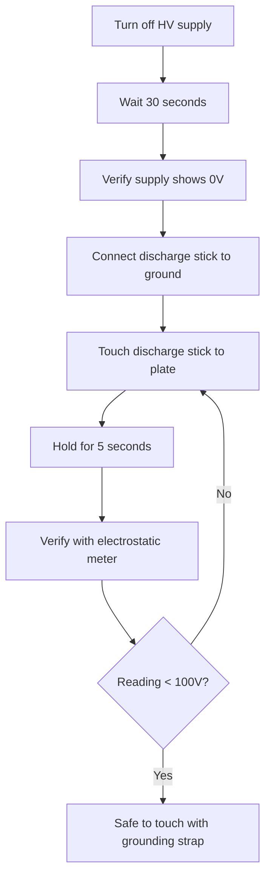

# ⚠️ Safety Documentation

> **READ THIS ENTIRE DOCUMENT BEFORE STARTING THE PROJECT**

This project involves hazards that can cause **serious injury or death** if not properly managed. Do not proceed unless you understand and can implement all safety measures.

---

## Hazard Summary

| Hazard | Severity | Likelihood | Risk Level | Primary Control |
|--------|----------|------------|------------|-----------------|
| Electric shock (HV) | Fatal | Possible | **CRITICAL** | Current limiting, procedures |
| Electric shock (mains) | Fatal | Possible | **CRITICAL** | Proper wiring, RCD/GFCI |
| Corona discharge burns | Serious | Likely | **HIGH** | Distance, insulation |
| Ozone inhalation | Moderate | Likely | **MEDIUM** | Ventilation |
| UV exposure | Moderate | Possible | **MEDIUM** | Shielding, time limits |
| Hearing damage | Moderate | Possible | **MEDIUM** | Ear protection |
| Projectile (plate failure) | Serious | Unlikely | **LOW** | Shielding |
| Fire | Serious | Unlikely | **LOW** | No flammables, extinguisher |

---

## High Voltage Safety

### The One-Hand Rule

**ALWAYS keep one hand behind your back or in your pocket when working near energized HV equipment.** This prevents current from passing through your heart.

### Current Limiting is Essential

The HV supply MUST be current-limited to < 1 mA. At this current:
- Shock is painful but survivable
- Capacitors cannot store lethal charge
- Arc energy is limited

**Never use a supply capable of more than 1 mA at HV without additional current limiting.**

### Discharge Procedure

Before touching ANY part of the apparatus after HV operation:



### Discharge Stick Construction

Build a discharge stick from:
- 1 meter insulating rod (fibreglass, PVC, or dry wood)
- 10 MΩ resistor chain (rated for HV)
- Grounding wire to mains earth

The resistor limits discharge current to prevent:
- Damage to the plate surface
- Loud/startling spark
- EMI to nearby electronics

### Emergency Procedures

**If someone receives an electric shock:**

1. **DO NOT TOUCH THEM** if they're still in contact with the source
2. Disconnect power at the source or circuit breaker
3. Call emergency services (999/112/911)
4. If safe, move them away from the source using non-conductive material
5. Check breathing and pulse
6. Begin CPR if needed and trained
7. Treat for shock (lay flat, elevate legs, keep warm)

**Post emergency contact numbers near the workspace.**

---

## Workspace Requirements

### Minimum Requirements

- [ ] Dry environment (< 70% relative humidity)
- [ ] Non-conductive flooring (rubber mat minimum)
- [ ] Clear of flammable materials within 2 meters
- [ ] Adequate ventilation (for ozone)
- [ ] Fire extinguisher (CO₂ or dry powder) within reach
- [ ] First aid kit present
- [ ] Emergency power cutoff accessible
- [ ] Another person present or on-call

### Recommended Additions

- [ ] RCD/GFCI protected mains supply
- [ ] Isolation transformer for mains equipment
- [ ] Grounded anti-static wrist strap
- [ ] HV warning signs posted
- [ ] Interlocked enclosure

---

## Personal Protective Equipment

### Required PPE

| Item | Specification | When Required |
|------|---------------|---------------|
| Safety glasses | Side shields, polycarbonate | Always |
| Closed-toe shoes | Insulating soles preferred | Always |
| Long trousers | Non-synthetic preferred | Always |
| No jewellery | Remove rings, watches, necklaces | During HV operation |

### Situational PPE

| Item | Specification | When Required |
|------|---------------|---------------|
| Hearing protection | NRR 25+ | Vibration > 1 kHz |
| HV gloves | Class 0 minimum (1kV rated) | HV system maintenance |
| Face shield | Full face, polycarbonate | Initial HV tests |
| Lab coat | Cotton, not synthetic | Extended HV operation |

---

## Corona Discharge Hazards

### Ozone Production

Corona discharge produces ozone (O₃), which is:
- Toxic at concentrations > 0.1 ppm
- Detectable by smell at ~0.01 ppm ("fresh/electric" smell)
- Heavier than air, accumulates at floor level

**Mitigation:**
- Work in well-ventilated area
- Use extraction fan if running > 10 minutes
- Take breaks outside the area
- If strong ozone smell, stop and ventilate

### UV Radiation

Corona discharge produces UV radiation, primarily UV-C:
- Can cause eye damage (welder's flash)
- Can cause skin burns with prolonged exposure

**Mitigation:**
- Do not stare at corona discharge
- Polycarbonate shielding blocks UV
- Limit continuous operation time

### Nitrogen Oxides

Sustained corona produces NOₓ, which:
- Combines with moisture to form nitric acid
- Corrodes equipment
- Irritates respiratory system

**Mitigation:**
- Ventilation
- Clean equipment after extended runs
- Limit continuous operation

---

## Mechanical Safety

### Piezo Actuator Hazards

Piezoelectric actuators can:
- Generate high voltages when mechanically shocked
- Shatter if overdriven (ceramic shrapnel)
- Overheat if driven at resonance for extended periods

**Mitigation:**
- Never exceed rated displacement
- Use polycarbonate shield around assembly
- Monitor temperature during operation
- Allow cooling periods

### Plate Failure Modes

Although unlikely, the copper plate could:
- Detach from actuator if adhesive fails
- Fracture if driven at resonance with flaws present

**Mitigation:**
- Inspect plate and bonds before each session
- Use polycarbonate enclosure
- Stay clear of plate plane during operation

---

## Electrical Safety (Mains)

### Grounding

All equipment chassis must be properly grounded:
- Function generator
- Amplifier
- HV supply
- Faraday cage
- Oscilloscope

Use a ground continuity tester before first operation.

### Mains Wiring

- All mains wiring must be done by a competent person
- Use appropriate cable ratings
- Include RCD/GFCI protection
- Fuse all circuits appropriately

### Isolation

Consider using an isolation transformer for:
- Increased safety margin
- Reduced ground loop noise
- Protection from mains transients

---

## Emergency Equipment Checklist

Before each session, verify presence of:

- [ ] Fire extinguisher (serviced within 12 months)
- [ ] First aid kit (stocked)
- [ ] HV discharge stick (tested)
- [ ] Insulating mat (dry, undamaged)
- [ ] Emergency power cutoff (functional)
- [ ] Mobile phone (charged, in reach)
- [ ] Emergency contact list (posted)
- [ ] Safety glasses (clean, undamaged)

---

## Operating Procedures

### Pre-Session Checklist

```
[ ] Review today's experimental plan
[ ] Verify another person is present or on-call
[ ] Check all safety equipment present
[ ] Inspect HV connections for damage
[ ] Verify ground connections
[ ] Clear workspace of unnecessary items
[ ] Remove jewellery
[ ] Don PPE
[ ] Test emergency power cutoff
[ ] Verify ventilation operating
```

### During Operation

```
[ ] One hand rule near HV
[ ] Monitor for unusual sounds/smells
[ ] Watch for excessive corona (visible discharge)
[ ] Check temperatures periodically
[ ] Take breaks every 30 minutes
[ ] Log any anomalies immediately
```

### Post-Session Checklist

```
[ ] Power down all equipment in sequence
[ ] Execute discharge procedure
[ ] Verify discharge with meter
[ ] Ground all HV components
[ ] Allow piezo to cool
[ ] Secure HV supply
[ ] Ventilate area for 10 minutes
[ ] Document session in log
[ ] Store equipment properly
```

---

## Training Requirements

Before operating this apparatus, you should have:

### Essential Knowledge
- [ ] Basic electrical safety principles
- [ ] Understanding of capacitor discharge hazards
- [ ] CPR/First Aid training (recommended)
- [ ] Familiarity with this safety document

### Essential Skills
- [ ] Ability to use a multimeter safely
- [ ] Experience with soldering and electronics assembly
- [ ] Ability to recognise electrical faults
- [ ] Calm response to unexpected events

### Recommended Background
- [ ] Previous experience with HV systems
- [ ] Understanding of experimental physics methodology
- [ ] Familiarity with hackspace/makerspace safety culture

---

## Incident Reporting

All incidents, near-misses, and safety concerns must be documented:

### What to Report
- Electric shocks (even minor)
- Equipment failures
- Near-miss events
- Unexpected behaviours
- Safety equipment failures

### Reporting Format

```markdown
## Incident Report

**Date/Time:** 
**Personnel Present:** 
**Activity:** 

### Description
[What happened]

### Immediate Actions Taken
[What you did]

### Root Cause Analysis
[Why it happened]

### Corrective Actions
[What will prevent recurrence]

### Follow-up Required
[Any outstanding actions]
```

---

## Document Control

| Version | Date | Author | Changes |
|---------|------|--------|---------|
| 1.0 | 2024-XX-XX | [Name] | Initial release |

**This document must be reviewed before each build session.**

---

## Signatures

I have read and understood this safety documentation:

| Name | Date | Signature |
|------|------|-----------|
| | | |
| | | |
| | | |

---

*Safety is not optional. If you're unsure about any aspect of this project, stop and seek advice.*
